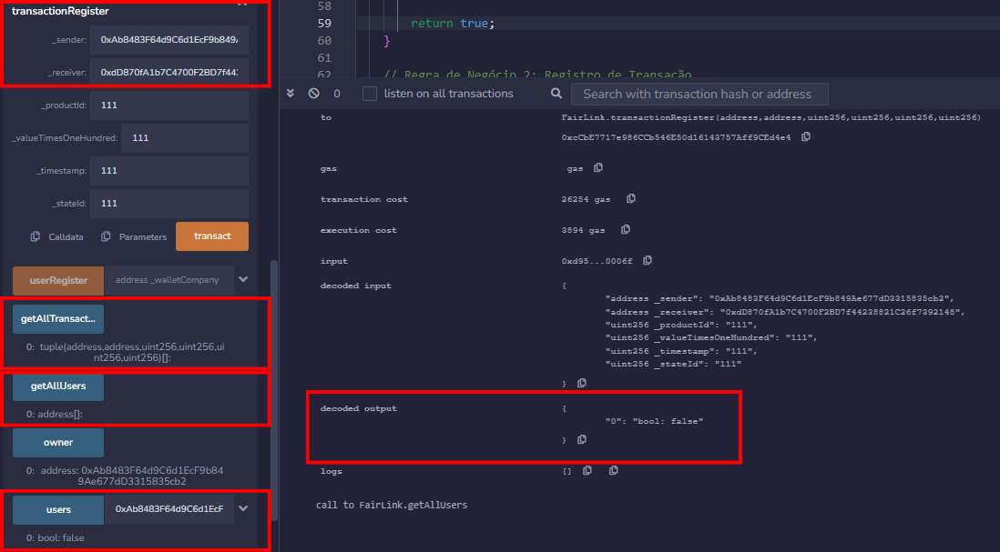

# Documentação Blockchain - Módulo 5 - Inteli

## Blockoli

##### Ana Carolina Cremonezi Martire, Henrique Cox Cabral Oliveira de Moura, Kaylane de Cássia Vasconcelos de Brito, Marcelo Faska Sitton, Marcelo Saadi Pessini, Nicollas Isaac Queiroz Batista e Ricardo Baumgart Magalhães de Novaes

## Sumário

[1. Introdução](#c1)

[2. Entendimento do Negócio](#c2)

[3. Entendimento da Experiência do Usuário](#c3)

[4. Análise de Risco (Segurança da Informação)](#c4)

[5. Smart Contracts](#c5)

[6. Documentação Frontend](#c6)

[7. Referências](#c7)

[8. Singularidades do Projeto](#c8)

 

## 1. Introdução

&nbsp;&nbsp;&nbsp;&nbsp;A Alliance Consultoria é uma empresa especializada nas áreas tributária e supply chain para clientes SAP, que atende negócios nacionais e multinacionais de grande porte, como o grupo Boticário. Com mais de 32 anos de experiência, a organização participou de vários projetos-piloto do governo para os SPEDs, e oferece soluções como implantação, BPO, AMS, e treinamento em SAP TDF [1].

&nbsp;&nbsp;&nbsp;&nbsp;Competência é o que define a Alliance Consultoria. Com uma equipe altamente qualificada e certificada, ela entrega resultados de excelência para seus clientes, garantindo a conformidade fiscal e a otimização dos processos de supply chain. A consultoria está sempre atualizada com as novidades do mercado e as exigências legais, buscando as melhores práticas e soluções para cada cenário. E, portanto, o grupo *Blockoli* foi acionado.

&nbsp;&nbsp;&nbsp;&nbsp;Em questões de segurança e transparência de transações pelo mundo inteiro, a tecnologia Blockchain vem crescendo cada vez mais. Ela, de acordo com o grupo *Stefanini*, é considerada “uma grande revolução tecnológica”, pois “torna possível que empresas e pessoas de qualquer parte do mundo realizem pagamentos e outros tipos de troca de forma transparente, ágil, abrangente, segura e extremamente barata”. Era de se esperar que a Alliance Consultoria quisesse implementar tamanha tecnologia em seu negócio, e é isso que a *Blockoli* fará pela empresa [2].

### 1.1 Objetivos

&nbsp;&nbsp;&nbsp;&nbsp;O objetivo da Alliance Consultoria é, de forma geral, dinamizar o processo de cotação do mercado, utilizando a Blockchain para aumentar a transparência e segurança do processo como um todo. Mais especificamente, a empresa pretende que esse serviço consiga determinar o preço médio de mercado para produtos e serviços, promovendo preços justos para todos os seus usuários, além de fornecer um histórico de transações em tempo real e transparentes, podendo ser examinado por qualquer usuário.

## 2. Entendimento do Negócio

### 2.1 Matriz de Avaliação "oceano azul"
&nbsp;&nbsp;&nbsp;&nbsp;A Matriz de Avaliação de Valor de "oceano azul" tem como objetivo apresentar uma abordagem estratégica inovadora para a reconstrução do negócio em relação aos concorrentes do mercado. Para esta análise, foram empregadas oito métricas que permitem comparar a plataforma com outras empresas. Cada métrica é avaliada em uma escala de 0 a 10, indicando o grau de atendimento desses aspectos pelas empresas concorrentes. Tais métricas são:
 
- Transparência de preços: A clareza e a previsibilidade dos custos associados a produtos ou serviços, que permite que clientes façam escolhas informadas.

- Segurança e confiança na contratação de fornecedores: A capacidade dos fornecedores de oferecer um serviço ou produto de forma segura e confiável, assegurando a integridade das transações.

- Eficiência e satisfação do usuário: A otimização dos processos para a economia de tempo e recursos do usuário, resultando em uma experiência positiva e na satisfação geral com o serviço ou produto.

- Histórico de transações e possibilidade de auditoria: A manutenção de registros detalhados das transações que podem ser examinados posteriormente para garantir transparência e conformidade.

- Transparência no processo: A visibilidade e compreensão claras de todas as etapas de um processo de negócios, permitindo rastreabilidade e responsabilidade.

- Eficiência do processo de cotação: A rapidez e precisão com que as cotações são geradas e processadas, economizando tempo e reduzindo a complexidade para os usuários.

- Utilização de blockchain para transparência e confiabilidade: A adoção da tecnologia blockchain para garantir que os registros de transações sejam imutáveis e verificáveis, aumentando a confiança no sistema.

- Preços justos e redução da necessidade de negociação: A definição de preços com base no valor percebido e na equidade, minimizando a necessidade de longas negociações e haggling.

 

Figura 1 - Matriz De Riscos

Fonte: Material produzido pelos autores (2024)

 

&nbsp;&nbsp;&nbsp;&nbsp;A imagem apresenta possíveis concorrentes que podem capturar parte do mercado da solução. Entre eles, destacam-se:
 
- **Alibaba:** Representada pela cor azul, a empresa é uma gigante do comércio de suprimentos e mercadorias em grande escala, operando como um marketplace de grande porte. A Alibaba não se destaca por seus projetos em blockchain (surpeendentemente, a tecnologia está praticamente ausente na companhia). Entretanto, ela se mantém mediana em relação aos outros tópicos relevados.
 
- **Tradeshift:** Representada pela cor vermelha, é uma empresa que se destaca como uma plataforma líder no mercado de comércio e serviços financeiros digitais, fato que pode ser relacionado com a proposta de solução da *Blockoli*. Reconhecida por sua ampla gama de soluções, a Tradeshift oferece um ambiente inovador para transações comerciais e financeiras. Entretanto, ela não guarda o histórico de transações de seus clientes para uma possibilidade de auditoria. Vale ressaltar que a Tradeshift também está ativa no desenvolvimento de projetos em blockchain, posicionando-se como uma concorrente significativa nesse campo, com potencial para impactar diretamente o setor.
 
- **Mercado Livre Empresas:** Representada pela cor amarela, é uma empresa que atua principalmente na américa latina. Sendo conhecida pelo seu marketplace individual, a organização possui uma ramificação de venda de itens e suprimentos em grande escala em formato de marketplace. Por entender as necessidades individuais dos usuários na américa latina, ela se destaca por seu grande índice de satisfação do cliente. Entretanto, não possui nenhum projeto em blockchain que beneficie sua confiança e rastreabilidade, fato que também reduz sua qualidade de auditoria e rastreabilidade.
 
- **Fair Link:** Representada em verde, a solução da *Blockoli* se destaca pela maximização de todos os tópicos colocados como base, com excessão da eficiência e satisfação do usuário. Afinal, a solução ainda não foi utilizada, então não existe histórico de satisfação do usuário. Além disso, o preço que será atribuído à solução é desconhecido, fato que dificulta a categorização de um preço justo para os usuários. Portanto é pertinente ressaltar que a solução identifica um distinto "oceano azul" em relação aos concorrentes, uma vez que concentra seus esforços em áreas que as empresas concorrentes geralmente negligenciam.
 

&nbsp;&nbsp;&nbsp;&nbsp;Ao explorarmos a estratégia da matriz de "oceano azul", notamos que nossa solução, *Fairlink*, está adentrando setores onde a concorrência não detém muito domínio. Este cenário nos permite identificar um verdadeiro ""oceano azul"", especialmente no contexto da aplicação do blockchain. Além disso, reconhecemos a necessidade de desenvolver um método eficaz para captar KPIs relacionados à satisfação do cliente. Também entendemos que precisamos eperfeiçoar a proposta de redução de negociação.
&nbsp;&nbsp;&nbsp;&nbsp;Ademais, para analisar a estratégia utilizada no "oceano azul", utilizamos essas 8 métricas aplicadas a metodologia EREC, uma ferramenta de análise estratégica que ajuda a visualização de classificação das métricas, sendo fragmentadas em o que deve ser Eliminado, Reduzido, Elevado e Criado.

 

Figura 2 - Matriz De Riscos

Fonte: Material produzido pelos autores (2024)

 

&nbsp;&nbsp;&nbsp;&nbsp;Ao observar a matriz EREC, torna-se evidente a necessidade de abordar determinados tópicos para posicionar nossa solução de forma ideal dentro de um contexto de "oceano azul". Esses tópicos incluem:
- Eliminar: A possibilidade de manipulação de dados dentro da blockchain.
- Reduzir: O custo para o usuário final para aumentar o acesso e a adoção.
- Criar: Um sistema que melhore a transparência e a confiança no processo de cotação, facilitando uma redução na necessidade de negociação.
- Elevar: A captação e análise de KPIs relacionados à satisfação do usuário para melhorar continuamente a experiência do cliente.
 

### 2.2 Matriz de Risco
&nbsp;&nbsp;&nbsp;&nbsp;A matriz de riscos é um método utilizado para estimar a probabilidade de um determinado evento ocorrer e seus respectivos impactos, isto é, como ele alteraria o ambiente de trabalho. Este quadro é organizado em forma de uma tabela, composta por linhas e colunas que exibem pequenas células, e é avaliado considerando duas dimensões:

- Na vertical: a probabilidade de ocorrência;
- Na horizontal: a magnitude do impacto.

&nbsp;&nbsp;&nbsp;&nbsp;No desenvolvimento do portal de preços ideiais da Alliance Consultoria, focado no consumidor interno e na integração com blockchain, a matriz de risco é fundamental para navegar em um mercado tecnológico em constante mudança e altamente competitivo. Ela não só identifica riscos técnicos, legais (Jurisdição) e de mercado, como também destaca oportunidades de inovação e diferenciação. A identificação proativa de ameaças, como falhas de segurança ou desafios de integração, permite mitigar impactos negativos, enquanto a percepção de oportunidades facilita a tomada de decisões que alinham o projeto às necessidades dos usuários e às tendências tecnológicas.

&nbsp;&nbsp;&nbsp;&nbsp;Essa abordagem estratégica para a gestão de riscos garante que o projeto não apenas cumpra com as expectativas de segurança e conformidade, mas também se posicione como uma solução líder no mercado, superando as demandas dos consumidores internos por eficiência e confiabilidade. A matriz de risco, assim, desempenha um papel crucial na maximização do potencial de sucesso do projeto, promovendo uma cultura de inovação contínua e excelência operacional [3].

&nbsp;&nbsp;&nbsp;&nbsp;A matriz de risco desenvolvida pela Alliance Consultoria classifica os riscos e oportunidades utilizando uma escala de impacto até 5 e uma escala de probabilidade até 10. Para promover uma compreensão imediata e eficaz desses riscos, adotou-se um sistema de codificação por cores:

- **Verde:** Significa riscos com baixa probabilidade e impacto. São riscos que, apesar de existirem, possuem poucas chances de acontecer e, se acontecerem, terão um impacto mínimo sobre as operações e estratégias da Alliance Consultoria.
- **Amarelo:** Representa riscos com probabilidade e impacto moderados. Esses riscos requerem um monitoramento constante, pois apresentam um potencial moderado de impactar negativamente a organização, demandando preparação para uma resposta adequada.
- **Vermelho:** Sinaliza riscos de alta probabilidade e impacto elevado. São riscos que exigem ações imediatas e planos de mitigação robustos devido ao seu potencial significativo de afetar de forma grave as operações e metas da Alliance Consultoria.

&nbsp;&nbsp;&nbsp;&nbsp;Com este sistema de cores, a Alliance Consultoria consegue identificar de maneira intuitiva e rápida os riscos, assegurando uma gestão eficaz que permite a organização estar sempre pronta para enfrentar adversidades e capturar oportunidades dentro do seu ambiente de atuação.

Quadro 1 - Matriz De Riscos

Fonte: Material produzido pelos autores (2024)

&nbsp;&nbsp;&nbsp;&nbsp;Na matriz de risco que apresentamos, os números listados sequencialmente, como 1, 2, 3, e assim sucessivamente, indicam os diversos riscos identificados. Já os números acompanhados pela letra "P", tal como 1P ou 2P, sinalizam uma oportunidade, não um risco. Essa abordagem facilita o reconhecimento e a distinção entre riscos e oportunidades dentro da matriz.

&nbsp;&nbsp;&nbsp;&nbsp;Em relação à procedência desses riscos, incluindo seus impactos, probabilidades, razões, estratégias de mitigação e responsáveis, todos foram cuidadosamente investigados e documentados. Estes detalhes são explicados e fundamentados nas seguintes imagens, oferecendo um entendimento detalhado de cada ponto mencionado na matriz.

Tabela 1 - Análise de Riscos

| ITEM | Cat.  | Risco | Onde Impacta | Avaliação | Resp. | Ação de Contorno | Justificativa                                                                     |
|:----:|:-----:|:----:|:-----------:|:------------:|:---:|:-----------------------:|:--------------------------------------------------------------------------------:|
| 1 | Interno | Dificuldade na integração com sistemas existentes |  Implementação da tecnologia | Impacto 3 x Probabilidade 50% | BRK |  Desenvolver uma API flexível e documentação detalhada para facilitar a integração | A complexidade e a variedade dos sistemas de TI nas empresas podem dificultar a integração sem uma interface bem projetada |
| 2 | Externo | Mudanças regulatórias afetando o uso de blockchain | Conformidade legal | Impacto 4 x Probabilidade 30% | DJ |   Monitoramento contínuo das legislações e adaptação rápida da plataforma conforme necessário | A tecnologia blockchain ainda está na pauta regulatória em muitas jurisdições, podendo haver mudanças nas leis que afetem sua aplicação |
| 3 | Interno | Falha na segurança da informação | Segurança dos dados | Impacto 5 x Probabilidade 30% | ALI | Implementar protocolos de segurança robustos e realizar testes de penetração regularmente | A natureza sensível das transações e a tecnologia blockchain exigem altos padrões de segurança para prevenir violações de dados |
| 4 | Interno | Capacidade técnica insuficiente da equipe | Desenvolvimento do projeto | Impacto 3 x Probabilidade 50% | BRK e ALI | Fechar bem o escopo e as espectativas com a Alliance e BRK | O conhecimento em tecnologias como blockchain, desenvolvimento de API's, são cruciais para o sucesso do projeto e pode não estar presente internamente |
| 5 | Externo | Alta volatilidade do mercado de criptomoedas afetando a estabilidade do projeto | Estabilidade econômica | Impacto 2 x Probabilidade 70% | MER |  Diversificação das fontes de estabilização dos custos operacionais | Embora o projeto utilize blockchain, a percepção do mercado sobre as criptomoedas pode influenciar indiretamente o financiamento e a confiança no projeto |
| 6 | Interno | Ausência de integrantes da BRK no desenvolvimento  | Desenvolvimento do projeto | Impacto 5 x Probabilidade 30% | BRK | Manter contato entre a equipe sempre e atualizar continuamente sobre impedimentos que podem ocorrer |
| 7 | Interno | Falta de recursos do Inteli | Desenvolvimento do Projeto | Impacto 5 x Probabilidade 10% | Inteli | Solicitar recursos adicionais. | A faculdade pode não fornecer os recursos necessários, afetando a execução. |
| 8 | Externo | Mudanças de requisitos pela ALI | Escopo do projeto | Impacto 5 x Probabilidade 50% | ALI | Manter comunicação clara e frequente com a Alliance Consultoria | Requisitos mal definidos ou mudanças podem levar a retrabalho. |
| 9 | Externo | Atrasos na aprovação ou feedback da ALI | Progresso do Projeto | Impacto 5 x Probabilidade 50% | ALI | Contrato social claro com a Alliance Consultoria | Atrasos no feedback podem afetar o cronograma. |

Fonte: Material produzido pelos autores (2024)

#### Legenda de Abreviações e Siglas:
- Resp.: Responsável pelo risco
- BRK: Equipe Blockoli
- MER: Mercado
- ALI: Alliance Consultoria
- Inteli: Referência ao Instituto de Tecnologia e Liderança
- Cat: Categoria
- DJ: Departamento Jurídico

#### Compreendendo a Tabela de Avaliação de Riscos:
**1.** Item: Representa a ordem dos riscos listados, simplificando a identificação e discussão de cada um
**2.** Categoria (Cat.): Especifica se o risco vem de dentro ou fora da empresa, marcado como 'Interno' para fatores ligados à equipe ou operações internas, e 'Externo' para elementos fora do controle direto, como legislação ou clima
**3.** Risco: Apresenta o perigo ou desafio identificado, por exemplo, problemas de integração tecnológica ou atrasos na entrega
**4.** Onde Impacta: Mostra qual parte do projeto é impactada pelo risco, seja ela a segurança da informação, o cronograma do projeto ou qualquer outro aspecto crítico
**5.** Avaliação: Aqui, avaliamos a gravidade do risco com base em sua probabilidade de ocorrência e seu impacto
**6.** Responsável (Resp.): Indica quem ou qual departamento é encarregado de administrar o risco, assegurando que as ações preventivas sejam aplicadas
**7.** Ação de Contorno: Refere-se às ações planejadas para minimizar ou neutralizar o risco, evitando suas consequências negativas.
**8.** Justificativa: Oferece uma explicação sobre a importância do risco, elucidando os possíveis efeitos adversos no projeto caso não seja gerenciado de forma eficaz

#### Conclusão dos Riscos
&nbsp;&nbsp;&nbsp;&nbsp;A presença de riscos internos sugere a necessidade de fortalecer as capacidades internas, seja através de treinamento da equipe, melhoria dos processos de comunicação, ou adoção de tecnologias mais robustas e seguras. Por outro lado, os riscos externos destacam a importância de um monitoramento contínuo do ambiente externo, ajustando-se às mudanças regulatórias e preparando-se para condições imprevistas que possam impactar o projeto.

Tabela 2 - Análise de Oportunidades

| ITEM | Cat.  | Oportunidade | Avaliação | Justificativa |
|:----:|:-----:|:------------:|:---------:|:-------------:|
| 1P | Externo | Adoção de novas regulamentações favoráveis à tecnologia blockchain | Impacto 4 x Probabilidade 50% |  A evolução do quadro regulatório pode abrir portas para novos mercados e modelos de negócios, oferecendo uma chance para o projeto se estabelecer como líder em setores inovadores |
| 2P | Externo | Parcerias estratégicas com outras organizações | Impacto 5 x Probabilidade 30% | Estabelecer alianças com parceiros chave pode acelerar o desenvolvimento do projeto, expandir o alcance no mercado e aumentar a credibilidade da solução oferecida |
| 3P | Interno | Otimização de processos internos utilizando a própria solução | Impacto 3 x Probabilidade 50% |  Utilizar a tecnologia desenvolvida internamente para otimizar processos pode servir como um caso de sucesso e validação da solução, além de reduzir custos operacionais |
| 4P | Externo | Expansão para mercados emergentes | Impacto 4 x Probabilidade 50% | Mercados emergentes apresentam demandas crescentes por soluções inovadoras e podem oferecer um terreno fértil para a adoção rápida da tecnologia blockchain, representando um vasto potencial de crescimento |
| 5P | Interno | Transformar o projeto em uma StartUp | Impacto 5 x Probabilidade 10% | Há potencial para transformar o projeto em uma startup, abordando problemas similares em empresas distintas |

Fonte: Material produzido pelos autores (2024)

#### Entendendo a Tabela de Análise de Oportunidades:

**1.** Item: Representa a ordem das oportunidades listadas, simplificando a identificação e discussão de cada um
**2.** Categoria (Cat.): Especifica se a oportunidade vem de dentro ou fora da empresa, marcado como 'Interno' para fatores ligados à equipe ou operações internas, e 'Externo' para elementos fora do controle direto, como legislação ou clima
**3.** Oportunidade: Apresenta a oportunidade
**4.** Avaliação: Aqui, avaliamos a gravidade do risco com base em sua probabilidade de ocorrência e seu impacto
**5.** Justificativa: Oferece uma explicação sobre a importância da oportunidade, mostrando os possíveis efeitos positivos no projeto

#### Conclusão das Oportunidades
&nbsp;&nbsp;&nbsp;&nbsp;Este projeto, embora ousado em sua abordagem, enfrenta um caminho desafiador, mas está cercado de oportunidades significativas. Ao mergulhar em novas regulamentações, aprimorar habilidades internas e criar parcerias estratégicas, ele se posiciona em um mercado que ainda não é tão explorado. A expansão para mercados emergentes e a exploração da inovação tecnológica representam jogadas audaciosas que, se bem executadas, podem não apenas diferenciar o projeto, mas também estabelecê-lo como um marco no setor ("oceano azul").

#### Conclusão da Matriz de Riscos
&nbsp;&nbsp;&nbsp;&nbsp;A análise destaca que, embora o projeto carregue riscos técnicos e de mercado, as oportunidades de inovação e parcerias estratégicas apresentam um caminho promissor. A equipe deve focar em superar os desafios internos e externos com medidas precisas, buscando capitalizar as chances de expansão e liderança no setor.

 

### 2.3 Canvas Proposta de Valor

&nbsp;&nbsp;&nbsp;&nbsp;A Proposta de Valor, ou Value Proposition Canvas, é uma das 9 partes do Business Model Canvas. Traduzido da Investopedia, ela é “uma declaração concisa dos benefícios que uma empresa está entregando aos clientes que compram seus produtos ou serviços.” Esse modelo de negócio é dividido em duas partes, que se focam no cliente (à direita) e no produto a ser entregue (à esquerda). A primeira parte é a responsável por analisar os pedidos do cliente e suas demandas, portanto é denominada de “Perfil do Cliente”. Já a parte da esquerda é a proposta de valor em si, ou seja, é o que será entregue de acordo com os pedidos da empresa [4].

&nbsp;&nbsp;&nbsp;&nbsp;Durante a primeira etapa, o “Perfil do Cliente”, são analisados três elementos: as “tarefas do cliente” (qual é a solução que a empresa tem hoje), "dores" (quais problemas essa solução trás ou não consegue resolver) e "ganhos" (o que se espera alcançar após a nova solução proposta). No contexto do produto, a “Proposta de Valor” por si, os termos correspondentes são "produtos & serviços" (o que será a nova solução), "alívios" (os componentes do produto que conseguem, como o nome diz, aliviar as dores do usuário) e "criadores de ganho" (os recursos desenvolvidos para potencializar os benefícios obtidos).

&nbsp;&nbsp;&nbsp;&nbsp;Como visto na figura a seguir, a sua solução da Alliance atualmente consegue realizar, com excelência, o processo de gestão de compras, além de oferecer uma comparação fácil e simples para qualquer usuário. Porém, a empresa visa melhorar ainda mais. Para isso, foi pedido que se criasse uma solução em Blockchain, que entregasse transparência e segurança. Dessa forma, o preço apresentado possui maior credibilidade e confiabilidade.

&nbsp;&nbsp;&nbsp;&nbsp;Por meio dessa solução, entregue pelo grupo *Blockoli*, a consultoria resolverá os prejuízos no processo de cotação, ocorrentes devido à carência de transparência e segurança. Tais dores serão saciadas, pois a nova solução entregará maior transparência no seu negócio, fornecendo um histórico de transações reais e rastreáveis, o que melhora drasticamente o fluxo do seu processo de cotação.

&nbsp;&nbsp;&nbsp;&nbsp;A Alliance pretende que, ao trabalhar com a *Blockoli*, ela consiga fornecer um histórico de transações reais que contenham preços justos para todos os usuários do mercado. Isso será entregue, pois uma das bases da *FairLink* é a segurança de todos os órgãos presentes. Além disso, a solução precisa ter maior transparência, agilidade e rastreabilidade de todas as transações, gerando, assim, ainda mais confiabilidade. A solução não terá menos do que isso. Haverá um estabelecimento de preços padrões para todos os produtos e serviços, gerando a indispensável credibilidade, além de um ganho de tempo absurdo. Transações que demoravam dias para serem feitas, irão, com a *FairLink*, demorar meros segundos.

 

 Figura 3 - Proposta de Valor

Fonte: Material produzido pelos autores (2024)

 

&nbsp;&nbsp;&nbsp;&nbsp;Uma Proposta de Valor é criada para ajudar a entender o que uma empresa espera receber, e o que a solução terá que pode saciar suas vontades. Com a proposta criada pela consultoria Alliance, fica claro entender suas demandas e como a *Blockoli* vai atender e exceder seus pedidos. Dessa forma, as dores da empresa serão remediadas, pois a *FairLink* é uma solução que não somente irá melhorar o fluxo do processo de cotação, mas também irá aumentar a transparência e segurança das transações, e proporcionar um ótimo ganho de tempo para todos os seus usuários.

 

### 2.4 Análise Financeira 

&nbsp;&nbsp;&nbsp;&nbsp;Análise de custos é um processo fundamental em qualquer empreendimento, seja ele uma pequena empresa local ou uma grande corporação multinacional. Trata-se de um método sistemático de examinar e avaliar os gastos associados à produção de bens ou serviços. Essa análise não se limita apenas a identificar os custos diretos, como matéria-prima e mão de obra, mas também envolve a alocação de despesas indiretas e a compreensão de custos fixos e variáveis. A importância da análise de custos reside em sua capacidade de fornecer insights críticos para a tomada de decisões estratégicas. Ao compreender profundamente os custos envolvidos em cada etapa do processo produtivo, uma empresa pode identificar áreas de ineficiência, oportunidades de redução de custos e pontos de melhoria na gestão financeira. Isso não apenas aumenta a eficiência operacional, mas também contribui para a maximização dos lucros e a sustentabilidade financeira a longo prazo.

### Análise de Custos Operacionais 

&nbsp;&nbsp;&nbsp;&nbsp;Para estimar os custos de operação da plataforma, precisamos considerar dois aspectos principais, sendo eles, o custo do Gas de deploy e realização das funções do Smart-Contract, e hospedagem da plataforma. 

### Hospedagem

&nbsp;&nbsp;&nbsp;&nbsp;Considerando os custos da hospedagem, calculamos os valores com os preços das empresas: Linode, Vultr e DigitalOcean, visto que essas são empresas de porte menor, que permitem um cálculo mais preciso dos valores de hospedagem, pois possuem preços tabelados. Considerando uma plataforma com, em média, 2GB e 500 pessoas de tráfego mensal, temos:

#### Linode

Planos de CPU Compartilhada (Linode)
- Linode 2 GB
  - Preço: $12/mês
  - RAM: 2 GB
  - CPUs: 1
  - Armazenamento: 50 GB
  - Transferência: 2 TB
  - Entrada/saída da rede: 40/2 Gbps

- Linode 4 GB
  - Preço: $24/mês
  - RAM: 4 GB
  - CPUs: 2
  - Armazenamento: 80 GB
  - Transferência: 4 TB
  - Entrada/saída da rede: 40/4 Gbps

#### Vultr

Planos de Cloud Compute - Regular Performance
- 1 vCPU, 2 GB de RAM
  - Preço: $10/mês
  - Bandwidth: 2.00 TB
  - Armazenamento: 55 GB

- 2 vCPUs, 4 GB de RAM
  - Preço: $20/mês
  - Bandwidth: 3.00 TB
  - Armazenamento: 80 GB

Planos de Cloud Compute - High Frequency
- 1 vCPU, 2 GB de RAM
  - Preço: $12/mês
  - Bandwidth: 2.00 TB
  - Armazenamento: 64 GB

- 2 vCPUs, 4 GB de RAM
  - Preço: $24/mês
  - Bandwidth: 3.00 TB
  - Armazenamento: 128 GB

#### Digital Ocean
- Droplets
  - 1 vCPU, 2 GB de RAM
  - Preço: $12/mês
  - Bandwidth: 2 TB
  - Armazenamento: 50 GB

- 2 vCPUs, 4 GB de RAM
  - Preço: $24/mês
  - Bandwidth: 4 TB
  - Armazenamento: 80 GB

### Deploys e Funções do Smart-Contract
  &nbsp;&nbsp;&nbsp;&nbsp;O termo "Gas" é comumente utilizado em plataformas baseadas em blockchain, como Ethereum, para se referir à taxa paga pelos usuários para realizar transações ou executar contratos inteligentes na rede. Ele é essencialmente uma medida de custo de recursos computacionais necessários para executar uma determinada operação na blockchain. Cada operação consome uma quantidade específica de Gas, e o preço do Gas é determinado pelo mercado, variando de acordo com a demanda e oferta na rede.

- **Deploy do Contrato:** 

 &nbsp;&nbsp;&nbsp;&nbsp;Para calcular o valor do deploy do contrato, foi utilizado o Remix IDE, onde o contrato foi deployado, com uma cobrança de 0,000000000000854216ETH, o que, quando convertido para dólar, equivale a um valor tão próximo à zero que não vale ser considerado na Análise de Custos do projeto.

- **Funções do Smart-Contract:**

&nbsp;&nbsp;&nbsp;&nbsp;Dentro do Smart-Contract, existem diversas funções como: "GetAllUsers", "GetAllTransactions", "UserRegister". Entretanto, apenas as funções que atuem dentro da Blockchain consumem Gas. Logo, as únicas funções que devem ser consideradas são: "userRegister" (registra usuários dentro da rede) e "transactionRegister"(registra as transações dentro da rede). 

&nbsp;&nbsp;&nbsp;&nbsp;Considerando a volatilidade do valor do Ethereum, para estimar um custo do Gas, consideraremos o preço do Ethereum como $3000,00, que seria uma média aproximada dos valores do Ethereum nos últimos 6 meses. Logo:

- UserRegister:
  - Gas: 0.000922
  - ETH: 0.00092185
  - Preço em dólar: $2,76

- TransactionRegister:
  - Gas: 0.00082569
  - ETH: 0.00073658
  - Preço em dólar: $2,20

&nbsp;&nbsp;&nbsp;&nbsp;Sabendo desses valores, considerando que, por mês, tenhamos 50 usuários registrados e 100 transações registradas, temos um custo total de 110,00 dólares mensais para função UserRegister e 276,00 dólares mensais para função TransactionRegister, o que somado, resulta em um custo mensal de 386,00 dólares para realização das funções do Smart-Contract.

### Análise de Custos de Produção 

&nbsp;&nbsp;&nbsp;&nbsp;Vamos considerar um exemplo prático para ilustrar esse conceito. Dentro do projeto, temos um time formado por 7 pessoas, trabalhando, dentro das 10 semanas de desenvolvimento, 80 horas totais. Entretanto, para ilustrarmos esse exemplo, podemos imaginar 3 desenvolvedores representando o projeto, sendo 2 deles Desenvolvedores fullstack e um Desenvolvedor especializado em Web3. Ao diminuírmos o time por uma metade aproximada, podemos considerar o dobro de horas trabalhas mensais. Portanto, temos: Time de 3 desenvolvedores trabalhando 16 horas semanais, somando 160 horas totais durante as 10 semanas do projeto.

- Total de horas trabalhadas por desenvolvedor:
16 horas/semana x 10 semanas = 160 horas
- Valor total para os desenvolvedores full stack:
2 devs x 160 horas x RS 43,75/hora = RS 14.000,00
- Valor total para o desenvolvedor Web3:
1 dev x 160 horas x RS 56,25/hora = RS 9.000,00
- Valor total de produção:
RS 14.000,00 + RS 9.000,00 = RS 23.000,00

&nbsp;&nbsp;&nbsp;&nbsp;Portanto, o valor total para dois desenvolvedores full stack e um desenvolvedor especializado em Web3 trabalharem 16 horas por semana durante 10 semanas seria de RS 23.000,00. Os valores por hora são RS 43,75 para os desenvolvedores full stack e RS 56,25 para o desenvolvedor Web3.

### Imprevistos e Flutuações no Preço do Ethereum

&nbsp;&nbsp;&nbsp;&nbsp;Além dos custos operacionais estimados, é crucial considerar um fundo para imprevistos e para lidar com a volatilidade do preço do Ethereum. A natureza altamente volátil do mercado de criptomoedas, especialmente do Ethereum, pode gerar desafios inesperados e impactar os custos do projeto de maneira significativa. Flutuações abruptas no valor do Ethereum podem influenciar diretamente os custos associados às transações na blockchain, incluindo taxas de Gas e contratos inteligentes.

&nbsp;&nbsp;&nbsp;&nbsp;Portanto, é prudente reservar uma porcentagem do orçamento para contingências, a fim de mitigar possíveis impactos financeiros negativos causados por imprevistos ou por variações no preço do Ethereum. Essa reserva pode ser utilizada para cobrir custos adicionais decorrentes de eventos não planejados ou para compensar perdas resultantes de quedas repentinas no valor do Ethereum.

## 3. Entendimento da Experiência do Usuário

### 3.1 Personas

&nbsp;&nbsp;&nbsp;&nbsp;Personas são representações fictícias de diferentes tipos de clientes que podem interagir com um produto ou serviço. Elas ajudam as empresas a visualizar de forma mais clara quem são seus clientes-alvo e como podem atender melhor às suas demandas. A criação de personas durante um projeto é crucial para auxiliar as equipes de desenvolvimento a tomar decisões mais informadas durante todo processo, garantindo que o produto final atenda às expectativas e necessidades dos usuários de forma eficaz.

&nbsp;&nbsp;&nbsp;&nbsp;Nesse caso, as personas são fundamentais para mostrar com clareza quem, de fato, utilizará a solução produzida pela *Blockoli*. Além disso, elas ajudam os desenvolvedores do projeto a identificar prováveis lacunas e desafios que a solução em blockchain pode resolver, garantindo que a mesma não tenha nenhum problema em nenhuma das partes atuantes. A seguir estão as 3 personas que a *Blockoli* desenvolveu.

 

**Persona: Vendedor**

Figura 4 - Persona 1

Fonte: Material produzido pelos autores com uso de IA this-person-does-not-exist (2024)

 

- **Nome:** Pedro Costa

- **Informações demográficas:**
  - Idade: 40 anos
  - Estado Civil: Casado
  - Filhos: Três filhos
  - Profissão: Diretor Comercial em uma empresa de tecnologia
  - Localização geográfica: São Paulo, SP
  - Perfil socioeconômico: Classe média alta
  - Formação acadêmica: Graduação em Administração de Empresas

- **Background:** Pedro é um profissional experiente que atua como diretor comercial em uma empresa de tecnologia em São Paulo. Casado e com três filhos, ele tem uma sólida carreira na área comercial e está sempre em busca de oportunidades para aumentar as vendas da empresa. Pedro valoriza a transparência e a concorrência saudável no mercado e busca sempre oferecer os melhores produtos e serviços aos clientes.

- **Dores, necessidades e desejos:**
  1. Pedro está constantemente de olho nas estratégias e preços praticados pela concorrência. Ele deseja ter acesso a informações precisas e atualizadas sobre os preços de venda praticados por outras empresas para ajustar suas próprias estratégias de vendas e manter a competitividade da organização onde trabalha.
  2. Valoriza a transparência e a concorrência saudável no mercado, buscando sempre oferecer os melhores produtos e serviços aos clientes. Para ele, é fundamental contar com parceiros de negócios confiáveis e estar ciente das práticas comerciais da concorrência.
  3. Espera que a plataforma ofereça suporte técnico especializado e treinamento para sua equipe de vendas, pois reconhece a importância de manter sua equipe atualizada e capacitada para enfrentar os desafios do mercado.
  4. Está aberto a novas tecnologias e soluções que possam otimizar o processo de vendas e aumentar a competitividade da empresa. Pedro busca constantemente maneiras de inovar e melhorar o desempenho da equipe de vendas, aproveitando ao máximo as oportunidades oferecidas pelo mercado.

- **Cenários de interação:** Pedro utiliza uma plataforma de registro na blockchain para monitorar os preços de venda praticados pela concorrência e ajustar suas estratégias de vendas conforme necessário. Ele analisa cuidadosamente as informações fornecidas pela plataforma e toma decisões estratégicas que beneficiam a empresa a longo prazo. Além disso, Pedro está sempre em contato com sua equipe de vendas, oferecendo suporte técnico e treinamento para garantir que estejam preparados para enfrentar os desafios do mercado.

- **Interesses e hábitos relacionados ao sistema ou produto:**
  - Está sempre em busca de oportunidades para aumentar as vendas da empresa e melhorar sua posição no mercado, utilizando ferramentas como CRM e análise de dados para acompanhar o desempenho da equipe de vendas e identificar áreas de melhoria.
  - Participa de cursos e workshops sobre gestão de vendas e negociação para aprimorar suas habilidades profissionais e manter-se atualizado com as últimas tendências do mercado.
  - Possui amplo conhecimento em tecnologia e utiliza sistemas e plataformas digitais em sua rotina de trabalho, buscando constantemente maneiras de otimizar os processos de vendas e melhorar a eficiência da empresa.

- **Nível de letramento digital:** Avançado. Pedro possui amplo conhecimento em tecnologia e utiliza sistemas e plataformas digitais em sua rotina de trabalho.

- **Citações diretas:**
  - "A concorrência é feroz, e precisamos estar um passo à frente. Para mim, é fundamental ter acesso a informações precisas sobre os preços praticados no mercado para ajustar nossas estratégias de vendas."
  - "Na minha visão, a transparência no mercado é essencial. Busco sempre parceiros de negócios confiáveis que valorizem uma competição saudável e honesta."
  - "Estamos sempre em busca de oportunidades para impulsionar nossas vendas e ganhar vantagem competitiva. Isso significa estar constantemente atento aos movimentos dos nossos concorrentes e às tendências do mercado."

---

**Persona: Comprador**

Figura 5 - Persona 2

Fonte: Material produzido pelos autores com uso de IA this-person-does-not-exist (2024)

 

- **Nome:** Mariana Almeida

- **Informações demográficas:**
  - Idade: 35 anos
  - Estado Civil: Casada
  - Filhos: Dois filhos
  - Profissão: Gerente de Compras em uma empresa de alimentos
  - Localização geográfica: Rio de Janeiro, RJ
  - Perfil socioeconômico: Classe média alta
  - Formação acadêmica: Graduação em Administração de Empresas

- **Background:** Mariana é uma profissional experiente e estrategista que atua como Gerente de Compras em uma empresa de alimentos no Rio de Janeiro. Sua sólida formação em administração de empresas e seu conhecimento aprofundado do mercado a tornam uma peça fundamental na tomada de decisões estratégicas da empresa. Casada e com dois filhos, Mariana equilibra sua carreira desafiadora com sua vida pessoal, sempre buscando o melhor para ambas as áreas.

- **Dores, necessidades e desejos:**
  1. Mariana está sempre preocupada em garantir que o preço praticado por determinada empresa seja justo e condizente com a qualidade dos produtos ou serviços oferecidos. Ela busca não apenas economia, mas também valor agregado para sua empresa.
  2. Valoriza a integridade e a transparência nas transações comerciais, buscando estabelecer parcerias duradouras com fornecedores confiáveis. Para Mariana, é essencial contar com fornecedores que pratiquem preços justos e transparentes.
  3. Espera que a plataforma ofereça uma interface intuitiva e fácil de usar, garantindo que sua equipe possa aproveitar ao máximo suas funcionalidades. Para Mariana, a praticidade e a eficiência são fundamentais para otimizar o processo de compras.
  4. Está aberta a soluções inovadoras que possam melhorar a eficiência do departamento de compras e agregar valor ao negócio. Mariana está sempre em busca de novas tecnologias e práticas que possam otimizar os processos de compras e impulsionar o crescimento da empresa.

- **Cenários de interação:** Mariana utiliza a plataforma de registro na blockchain para comparar os preços de venda de diferentes fornecedores e encontrar as melhores ofertas para sua empresa. Ela também acessa a plataforma regularmente para monitorar o mercado e garantir as melhores condições para suas compras.

- **Interesses e hábitos relacionados ao sistema ou produto:**
  - Está sempre de olho se o preço praticado por determinada empresa é justo, buscando garantir economia sem comprometer a qualidade.
  - Prioriza fornecedores que praticam preços transparentes e honestos, estabelecendo parcerias baseadas na confiança e na integridade.
  - Utiliza ferramentas de gestão de compras e sistemas de automação para otimizar processos e aumentar a eficiência do departamento de compras.

- **Nível de letramento digital:** Avançado. Mariana possui amplo conhecimento em tecnologia e utiliza sistemas e plataformas digitais em sua rotina de trabalho.

- **Citações diretas:**
  - "A justiça nos negócios é uma prioridade para mim. Busco informações sobre os preços praticados pelas empresas não apenas para encontrar as melhores ofertas, mas também para garantir que estamos fazendo negócios de forma ética e transparente."
  - "A honestidade e a transparência são valores fundamentais nas minhas negociações. Prefiro trabalhar com fornecedores que compartilhem desses princípios e ofereçam condições justas e transparentes."
  - "Minha preocupação principal é garantir que minha empresa faça negócios de forma ética e justa. Estou constantemente em busca das melhores oportunidades, mas sempre priorizando relações comerciais baseadas na honestidade e integridade."

---
**Persona: Funcionário da Alliance**

Figura 6 - Persona 3

Fonte: Material produzido pelos autores com uso de IA this-person-does-not-exist (2024)

 

- **Nome:** Renato Silva

- **Informações demográficas:**
  - Idade: 38 anos
  - Estado Civil: Solteiro
  - Filhos: Sem filhos
  - Profissão: Analista de Operações na Alliance
  - Localização geográfica: São Paulo, SP
  - Perfil socioeconômico: Classe média
  - Formação acadêmica: Graduação em Economia

- **Background:** Renato é um profissional dedicado que atua como analista de operações na Alliance, uma empresa líder no setor de tecnologia e blockchain. Solteiro e sem filhos, ele está focado em sua carreira e busca sempre se manter atualizado com as últimas tendências e inovações do mercado. Renato desempenha um papel fundamental na implementação e manutenção dos sistemas de blockchain da empresa, garantindo o bom funcionamento das operações.

- **Dores, necessidades e desejos:**
  1. Deseja garantir a integridade e segurança das transações registradas na blockchain, protegendo os dados contra qualquer forma de manipulação.
  2. Precisa de ferramentas de gerenciamento eficientes que permitam monitorar e controlar as transações realizadas na plataforma, assegurando a precisão e confiabilidade das operações.
  3. Valoriza a eficiência operacional da plataforma, buscando maneiras de otimizar os processos e garantir a fluidez das operações diárias.
  4. Espera receber suporte técnico adequado para solucionar problemas operacionais e garantir o bom funcionamento contínuo da plataforma, evitando interrupções no fluxo de trabalho.
  5. Está aberto a oportunidades de desenvolvimento profissional na área de blockchain e tecnologia, buscando aprimorar suas habilidades e conhecimentos para acompanhar as tendências e inovações do mercado.

- **Cenários de interação:** Renato utiliza as ferramentas de gestão e monitoramento da plataforma blockchain para garantir a integridade e segurança das transações realizadas pela Alliance. Ele também colabora com outras equipes da empresa para identificar possíveis melhorias nos processos de operação e gestão da plataforma.

- **Interesses e hábitos relacionados ao sistema ou produto:**
  - Está constantemente explorando novas tecnologias e inovações, especialmente aquelas relacionadas à blockchain. Ele acompanha de perto pesquisas acadêmicas, artigos técnicos e participa ativamente de fóruns online sobre o assunto.
  - É membro ativo de várias comunidades online e grupos de discussão dedicados à blockchain. Ele compartilha experiências, tira dúvidas e colabora com outros profissionais do setor para expandir seu conhecimento e contribuir para o avanço da tecnologia.
  - Faz questão de participar regularmente de eventos, conferências e workshops relacionados à blockchain. Ele vê essas oportunidades como uma forma de se manter atualizado com as últimas tendências, além de expandir sua rede de contatos profissionais.

- **Nível de letramento digital:** Avançado. Renato possui amplo conhecimento em tecnologia e sistemas de informação, especialmente na área de blockchain.

- **Citações diretas:**
  - "Acredito que o aprendizado contínuo é a chave para o sucesso profissional. Sempre estou buscando novas oportunidades de crescimento e desenvolvimento, seja por meio de cursos, workshops ou experiências práticas."
  - "Para mim, a eficiência e a precisão nos processos de operação e gestão da plataforma são fundamentais. Busco constantemente maneiras de aprimorar esses aspectos para garantir o melhor desempenho possível."
  - "Como profissional da área de tecnologia, estou constantemente buscando maneiras de otimizar processos e melhorar a eficiência operacional. Acredito que a automação e a inovação são chaves para impulsionar o crescimento e o sucesso de uma empresa."

---

&nbsp;&nbsp;&nbsp;&nbsp;Conclui-se que a criação e compreensão detalhada das personas Pedro Costa, Mariana Almeida e Renato Silva oferece insights valiosos para as equipes de design e desenvolvimento. Ao considerar cuidadosamente as necessidades, dores e desejos dos usuários, as soluções desenvolvidas têm maior probabilidade de serem relevantes e eficazes. O design centrado no usuário, integrado com essas personas, promove a criação de produtos e sistemas que atendem não apenas às exigências tecnológicas, mas também às necessidades humanas. Essa abordagem contribui para a inovação e transformação em diversos setores, impulsionando o sucesso das empresas e melhorando a experiência dos usuários.

 

### 3.2 User Stories

&nbsp;&nbsp;&nbsp;&nbsp;User stories são pequenas descrições de funcionalidades ou requisitos do ponto de vista do usuário, escritas de forma simples e direta. Elas descrevem o que se deseja alcançar com o sistema ou produto, sem entrar em detalhes técnicos. Cada user story geralmente segue uma estrutura básica que inclui quem é o usuário, o que ele quer fazer e por que isso é importante para ele, quais são os critérios a serem avaliados para ter certeza de que sua função seja realizada com sucesso, e o que fazer caso ela seja ou não feita com sucesso.

&nbsp;&nbsp;&nbsp;&nbsp;No contexto do projeto, o uso dessa ferramente foi de suma importância para que a *Blockoli* entendesse quais são os principais requisitos que a solução em blockchain, *FairLink*, deve ter. Portanto, para cada persona, foram feitas, pelo menos, uma User Story. Dessa forma, é possível compreender quais possíveis problemas devem ser resolvidos com a solução. A seguir estão as 5 User Stories criadas para a solução em questão.

Tabela 3 - User Story 1 

| Número: 1.0     | Título: Acesso a informações para ajuste de estratégia de preços |
|---------|--------------------------------------------------|
| Personas | Pedro Costa (vendedor)                                |
| História| Como vendedor, eu quero acessar facilmente informações precisas sobre os preços de venda praticados por outras empresas para poder ajustar minha estratégia de preços e permanecer competitivo no mercado. |
| Critérios de aceitação | 1 - Acesso às informações de preços de venda praticados por outras empresas. 2- Acesso aos valores de preços médios de quaisquer produto. |
| Testes de aceitação | ****Critério de aceitação 01:**** Pedro consegue acessar as informações de preços de venda praticados por outras empresas. - Acesso obtido = correto. - Acesso não obtido = errado, deve ser corrigido.
|  | **Critério de aceitação 02:** Pedro consegue escolher o produto que deseja, e, em seguida, visualizar seu preço médio em comparação à outras empresas. - Acesso obtido = correto. - Acesso não obtido ou valor do produto errado foi mostrado = errado, deve ser corrigido. |

Fonte: Material produzido pelos autores (2024)

 

Tabela 4 - User Story 2 

| Número: 2.0  | Título: Comparação de preços de venda                                           |
|---------|--------------------------------------------------|
| Personas | Pedro Costa (vendedor)                                |
| História| Como vendedor, quero uma plataforma confiável e intuitiva onde eu possa comparar os preços de venda de meus produtos com os preços praticados pela concorrência, para que eu consiga tomar decisões informadas sobre os preços e garantir que estou oferecendo as melhores ofertas aos clientes. |
| Critérios de aceitação | 1 - Acesso à plataforma de comparação de preços. 2 - Facilidade de uso da plataforma. |
| Testes de aceitação | ****Critério de aceitação 01:**** O vendedor consegue acessar a plataforma de comparação de preços. - Acesso obtido = correto. - Acesso não obtido = errado, deve ser corrigido. 
|  | ****Critério de aceitação 02:**** O vendedor considera a plataforma intuitiva e fácil de usar. - Intuitiva e fácil de usar = correto. - Não intuitiva ou difícil de usar = errado, deve ser corrigido. |

Fonte: Material produzido pelos autores (2024)

 

Tabela 5 - User Story 3 

| Número: 3.0  | Título: Efetuação de Transação                                           |
|---------|--------------------------------------------------|
| Personas | Pedro Costa (vendedor)                                |
| História| Como vendedor, quero uma plataforma confiável e intuitiva onde eu possa efetuar transações, que, obrigatoriamente, vão conter valores importantes para o mim e para o comprador. |
| Critérios de aceitação | 1 - Acesso à plataforma de efetuação de transações. 2 - Facilidade de uso da plataforma. 3 - Uso adequado da plataforma, ou seja, inseriu todos os valores necessários (listados no **Critério de aceitação 03**). |
| Testes de aceitação | ****Critério de aceitação 01:**** O vendedor consegue acessar a plataforma de efetuação de transações. - Acesso obtido = correto. - Acesso não obtido = errado, deve ser corrigido. 
|  | **Critério de aceitação 02:** O vendedor considera a plataforma intuitiva e fácil de usar. - Intuitiva e fácil de usar = correto. - Não intuitiva ou difícil de usar = errado, deve ser corrigido.
|  | **Critério de aceitação 03:** O vendedor preencheu todos os campos obrigatórios da plataforma de forma correta. Ou seja, inseriu todas as informações importantes de uma transação, sendo estas o endereço da sua carteira, o endereço da certeira do comprador, o ID do produto/serviço, a quantidade de produtos/serviços vendidos, seu valor multiplicado por 100, a data e hora de quando a transação foi efetuada, o ID do estado onde a transação está sendo feita, e o preço do produto. - Preencheu de forma correta = correto. - Não preencheu todos os campos ou preencheu de forma incorreta = errado, deve ser corrigido. |

Fonte: Material produzido pelos autores (2024)

 

Tabela 6 - User Story 4 

| Número: 4.0  | Título: Comparação de preços de venda                                           |
|---------|--------------------------------------------------|
| Personas | Mariana Almeida (compradora)                            |
| História| Como compradora, eu quero ter acesso fácil à informações atualizadas sobre os preços de venda praticados por diferentes fornecedores, para que eu consiga comparar as ofertas e garantir que estou obtendo as melhores condições para a minha empresa. |
| Critérios de aceitação | 1 - Acesso à plataforma de comparação de preços. 2 - Facilidade de uso da plataforma. 3 - Precisão e atualização dos dados de preços. |
| Testes de aceitação | ****Critério de aceitação 01:**** A compradora consegue acessar a plataforma de comparação de preços. -Acesso obtido = correto. -Acesso não obtido = errado, deve ser corrigido. 
|  | ****Critério de aceitação 02:**** A compradora considera a plataforma intuitiva e fácil de usar. -Intuitiva e fácil de usar = correto. -Não intuitiva ou difícil de usar = errado, deve ser corrigido. |

Fonte: Material produzido pelos autores (2024)

 

Tabela 7 - User Story 5 

| Número: 5.0  | Título: Plataforma de Cotação Transparente e Segura                                            |
|---------|--------------------------------------------------|
| Personas | Mariana Almeida (Compradora)                            |
| História| Como compradora, eu quero uma plataforma de cotação que seja transparente e segura, para que eu possa realizar transações comerciais com fornecedores confiáveis, com pouco risco de negociações desonestas ou preços abusivos. |
| Critérios de aceitação | 1- Disponibilidade de informações claras e detalhadas sobre os fornecedores e seus produtos/serviços, como seu preço e número de identificação. 2- Implementação de medidas de segurança para proteger os dados e transações dos usuários. 3- Política clara e efetiva para lidar com negociações desonestas ou preços abusivos. |
| Testes de aceitação | **Critério de aceitação 01:** As informações sobre os fornecedores e seus produtos/serviços são claras e detalhadas. Ou seja, contêm valores como o preço do produto/serviço e seu ID. - Informações claras e detalhadas = correto. Informações não claras ou detalhadas = errado, deve ser corrigido.
|  | **Critério de aceitação 02:** As medidas de segurança foram implementadas com sucesso. Implementação bem-sucedida = correto. Implementação falhou = errado, deve ser corrigido.
|  | **Critério de aceitação 03:** A política para lidar com essas situações é clara e efetiva. Política clara e efetiva = correto. Política não clara ou efetiva = errado, deve ser corrigido. |

Fonte: Material produzido pelos autores (2024)

 

Tabela 8 - User Story 6 

| Número: 6.0 | Título: Segurança e Integridade de Transações                                           |
|---------|--------------------------------------------------|
| Personas | Renato Silva (Funcionário da Alliance)                |
| História| Como funcionário da Alliance, eu quero garantir a integridade e segurança das transações registradas na blockchain para manter a confiabilidade e a precisão dos dados da empresa. |
| Critérios de aceitação | 1 - Implementação de uma estrutura de segurança robusta para proteger as transações na blockchain. 2 - Verificação regular da integridade dos dados registrados na blockchain. |
| Testes de aceitação | **Critério de aceitação 01:** A estrutura de segurança foi implementada com sucesso Implementação bem-sucedida = correto. Implementação falhou = errado, deve ser corrigido.
|  | **Critério de aceitação 02:** A integridade dos dados da blockchain é verificada regularmente. Verificação realizada com sucesso = correto. Verificação não realizada ou falha = errado, deve ser corrigido. |

Fonte: Material produzido pelos autores (2024)

 

&nbsp;&nbsp;&nbsp;&nbsp;As user stories proporcionam uma base sólida para o desenvolvimento da solução, garantindo que as funcionalidades implementadas atendam diretamente às necessidades dos usuários. Por meio de critérios de aceitação bem definidos e testes de aceitação meticulosamente elaborados, é possível validar e garantir a eficácia das funcionalidades implementadas. Com isso, as User Stories não apenas orientam o desenvolvimento do produto, mas também garantem sua relevância e utilidade para os usuários finais, contribuindo significativamente para o sucesso do projeto.

 

## 4. Análise de Risco (Segurança da Informação)

&nbsp;&nbsp;&nbsp;&nbsp;No cenário atual da tecnologia digital, a blockchain e os contratos inteligentes (ou “chaincodes”) surgem como inovações revolucionárias com potencial para transformar diversos setores. Essas tecnologias oferecem vantagens significativas em termos de transparência, eficiência e segurança. No entanto, a complexidade e a novidade dessas soluções trazem consigo uma série de desafios de segurança, especialmente quando são aplicadas conjuntamente em contextos inovadores. [5]

&nbsp;&nbsp;&nbsp;&nbsp;O diagrama da arquitetura do projeto, presente na cessão 5.3, ilustra o sistema que foi desenvolvido em parceria com a Alliance Consultoria, onde os usuários interagem através de uma interface gráfica, suas ações são processadas e os requisitos de negócio são aplicadas, e os resultados são buscados da blockchain. A blockchain registra todas as transações e permite a auditoria, enquanto o SAP BTP atua como a camada de desenvolvimento e integração. A menção de contêineres e SAP Ariba sugere uso de tecnologias modernas de virtualização e integração com sistemas de procurement existentes.

&nbsp;&nbsp;&nbsp;&nbsp;Neste tópico, exploramos os requisitos de segurança essenciais, as vulnerabilidades potenciais e os tipos de ataques que podem ocorrer em um cenário de aplicação que envolve essas tecnologias. Além disso, analisamos a priorização desses ataques com base em sua probabilidade e impacto, visando desenvolver estratégias eficazes de mitigação e proteção.

**Descrição dos Requisitos de Segurança no Cenário de Aplicação**

- **Confidencialidade**: Garantir que as informações sensíveis, como preços históricos, dados de transações  e dados do usuário sejam acessíveis apenas por partes autorizadas pela Alliance Consultoria. Isso é crucial para que as informações sensíveis sejam protegidas contra acessos não autorizados, espionagem ou vazamento de dados.

- **Integridade**: Assegurar que os dados registrados no blockchain, incluindo o preço médio de mercado e o histórico de transações, não sejam alterados de forma indevida, sendo mantidas exatas e completas. Isso é fundamental para manter proteger os dados contra alterações não autorizadas (intencionais ou acidentais).

- **Autenticidade**: Garantir que todos os usuários e transações sejam genuínos, verificando a identidade dos usuários ou dispositivos envolvidos no processo. Isso é importante para evitar fraudes e garantir que as transações sejam realizadas entre partes legítimas.

- **Disponibilidade**: Assegurar que o sistema esteja sempre disponível para os usuários realizarem cotações e consultas de dados. Isso implica em proteger o sistema contra ataques de negação de serviço ou distribuídos, falhas de hardware, desastres naturais ou outros eventos que possam interromper o acesso aos serviços ou dados. Isso é essencial para a operacionalidade contínua do processo de negócio.

**Vulnerabilidades:**

- **Gestão de Identidades e Acessos**: A gestão inadequada de identidades e acessos pode permitir que atores não autorizados acessem informações sensíveis ou realizem transações fraudulentas, comprometendo a confidencialidade e a integridade dos dados. Isso pode ser evitado com mecanismos de controle de integridade como funções de hash criptográficas e assinaturas digitais.

- **Dependência da Ordem das Transações (TOD - Transaction-Ordering Dependence)**: Essa vulnerabilidade ocorre quando a ordem das transações, uma vez alterada, pode influenciar o estado final de um contrato inteligente de maneira imprevista ou maliciosa. Isso pode ser explorado por atores mal-intencionados para obter vantagens indevidas ou manipular o resultado de um contrato. Para evitar que a integridade do sistema seja ameaçada dessa forma, podemos projetar contratos inteligentes de maneira que o resultado de uma transação não dependa fortemente da ordem em que é processada.

- **Tratamento inadequado de exceções**: Ao invocar outro contrato inteligente, é essencial estar preparado para a possibilidade de que o contrato invocado não conclua sua execução com sucesso. A falta de um tratamento apropriado para conclusões anormais pode resultar em vulnerabilidades no contrato originador, as quais podem ser aproveitadas para ataques e fraudes. Isso pode ser evitado com o uso de funções, presentes na linguagem de programação Solidity, como require, revert, e assert que podem ser usadas para validar condições e reverter transações se necessário.

**Atacantes e Ataques Possíveis:**

- **Ataque de Interceptação de Dados**: Empresas concorrentes podem buscar obter vantagens competitivas interceptando informações sobre preços e transações para melhorar suas próprias estratégias de precificação ou para prejudicar a reputação da empresa. Esses atacantes podem visar interceptar dados durante a transmissão entre o aplicativo blockchain e o SAP BTP, explorando vulnerabilidades nas APIs ou na rede. Este ataque comprometeria a confidencialidade e integridade dos dados.

- **Ataque de Injeção**: Hackers especializados em fraude, focados em obter ganhos financeiros, podem utilizar injeção para manipular transações, inserir transações fraudulentas ou alterar preços. Esses atacantes podem explorar vulnerabilidades nas APIs para injetar comandos maliciosos, comprometendo a integridade dos dados.

- **Negação de Serviço (DoS)**: Grupos “Hacktivistas” que buscam chamar atenção para causas específicas podem usar ataques de DoS como uma forma de protesto contra as práticas empresariais ou políticas da empresa. Esses ataques podem ser realizados para sobrecarregar o sistema, tornando-o indisponível para usuários legítimos, comprometendo assim a disponibilidade.

**Priorização dos Ataques:**

Para priorizar os ataques, avaliamos sua probabilidade e impacto em uma tabela:
 

Tabela 9 - Análise de Ataques

|              Ataque            | Probabilidade | Impacto  | Risco |
|-------------------------------|--------------------|-------------|----------|
| Intercepção de Dados | Médio             | Alto        | Alto     |
| Ataque de Injeção       | Baixo              | Alto        | Médio |
| Negação de Serviço    | Alto                | Médio     | Alto     |

Fonte: Material produzido pelos autores (2024)

 

- **Intercepção de Dados**: Dada a natureza sensível das informações de transações, esse ataque é priorizado como alto risco devido ao seu alto impacto na confidencialidade e integridade dos dados.
- **Ataque de Injeção**: Embora tenha um impacto alto, a probabilidade é considerada mais baixa devido às medidas de segurança que podem ser implementadas nas APIs, resultando em um risco médio.
- **Negação de Serviço (DoS)**: A alta probabilidade e o impacto moderado na disponibilidade do sistema fazem deste um risco alto, especialmente considerando a importância da acessibilidade contínua para operações de negócios.

&nbsp;&nbsp;&nbsp;&nbsp;Através da análise feita, pode-se concluir que a identificação e a mitigação eficaz de vulnerabilidades, juntamente com a priorização consciente dos potenciais ataques, são etapas cruciais para garantir a segurança dessas tecnologias. Ao abordar proativamente os requisitos de confidencialidade, integridade, autenticidade e disponibilidade, e ao desenvolver estratégias robustas de defesa contra ataques, é possível explorar o potencial transformador da blockchain e dos contratos inteligentes de maneira segura e eficiente dentro do projeto e assim, entregar para a Alliance Consultoria um produto completo e seguro.

## 5. Smart Contracts

### 5.1 Implementação dos requisitos de negócios em testes

### Documentação do Requisito de Negócio 1: Cadastro de Usuário

#### Visão Geral
&nbsp;&nbsp;&nbsp;&nbsp;Ao adotar a solução FairLink, a Alliance busca proporcionar um histórico confiável e verificável de transações, que não apenas facilitará a determinação de preços justos para todos os usuários do mercado mas também melhorará consideravelmente a eficiência do processo de cotação. O requisito de negócio 1, focado no cadastro de usuários, é um pilar fundamental para alcançar esses objetivos. Ao garantir que apenas usuários autorizados possam registrar e participar do sistema, a FairLink estabelece a base para um ecossistema de transações transparente, ágil e rastreável. Isso é essencial para a construção de confiança entre os participantes do mercado e para a promoção de uma cultura de integridade e responsabilidade. Com o cadastro de usuários como primeira etapa crítica, a FairLink assegura que todas as transações realizadas na plataforma sejam autenticadas e vinculadas a entidades verificáveis, cumprindo a promessa de oferecer transparência total e segurança impenetrável. Este processo não apenas aborda as "dores" identificadas pela Alliance mas também pavimenta o caminho para uma revolução na forma como as transações são realizadas dentro do mercado. Com a implementação da FairLink, transações que anteriormente demoravam dias para ser concluídas agora podem ser realizadas em questão de segundos. Isso não só resulta em um ganho significativo de tempo mas também estabelece um padrão de preço justo e consistente para produtos e serviços, reforçando a credibilidade e a confiabilidade do sistema. O cadastro de usuários, portanto, não é apenas um procedimento operacional; é o alicerce sobre o qual a transparência, a segurança, a agilidade e a confiança do sistema FairLink são construídas, garantindo que a solução oferecida pela Blockoli atenda e supere as expectativas da Alliance.

#### Implementação
&nbsp;&nbsp;&nbsp;&nbsp;A função `userRegister` é responsável pelo registro de novos usuários no sistema. Para assegurar que apenas o proprietário do contrato (identificado pela variável `owner`, definida no construtor do contrato) possa registrar novos usuários, a função é protegida pelo modificador `onlyAlliance`. Isso alinha a função com o requisito de negócio que restringe o registro de usuários a uma autoridade central ou administrador do sistema, representado pelo `owner` do contrato, no caso a Alliance Consultoria.

 

 Figura 7 - Código Solidity: Requisito de Negócio 1

Fonte: Material produzido pelos autores (2024)

 

##### Verificação de Registro Existente
&nbsp;&nbsp;&nbsp;&nbsp;A função primeiro verifica se o endereço fornecido já está registrado como um usuário ativo:

 

 Figura 8 - Código Solidity: Requisito de Negócio 1 - Verificação

Fonte: Material produzido pelos autores (2024)

 

&nbsp;&nbsp;&nbsp;&nbsp;Essa verificação é crucial para evitar duplicatas na lista de usuários e garantir que cada endereço de carteira seja único dentro do sistema.

 

##### Registro do Usuário
&nbsp;&nbsp;&nbsp;&nbsp;Após a verificação de unicidade, a função registra o usuário, definindo seu valor no `mapping` de `users` para `true` e adicionando o endereço à lista `getAllUsers`. Isso efetivamente registra o usuário no sistema, permitindo-lhe participar de transações futuras ou acessar funcionalidades restritas.

 

 Figura 9 - Código Solidity: Requisito de Negócio 1 - Registro

Fonte: Material produzido pelos autores (2024)

 

##### Emissão de Evento
&nbsp;&nbsp;&nbsp;&nbsp;Finalmente, a função emite um evento `LogUserRegistration` para notificar ouvidores externos (por exemplo, interfaces de usuário ou outros contratos) de que um novo usuário foi registrado com sucesso. Isso facilita a integração e a transparência, permitindo que sistemas externos reajam adequadamente a mudanças no conjunto de usuários autorizados.

 

 Figura 10 - Código Solidity: Requisito de Negócio 1 - Emissão de Evento

Fonte: Material produzido pelos autores (2024)

 

#### Casos de Teste para o Requisito de Negócio 1: Cadastro de Usuário

##### Caso de Teste 1: Sucesso no Registro de Novo Usuário

###### Pré-condição:
- O usuário não está previamente registrado no sistema.
- A função é chamada pelo `owner` do contrato.

###### Etapas do Teste:
1. Identifique o endereço de carteira a ser registrado que ainda não está na lista de `getAllUsers`.
2. Execute a função `userRegister` com o endereço de carteira identificado como argumento, a partir da conta do `owner`.
3. Verifique o evento `LogUserRegistration` para confirmar o sucesso do registro.
4. Confirme se o endereço do usuário agora está listado em `getAllUsers` e marcado como `true` no `mapping` de `users`.

###### Pós-condição:
- O endereço do usuário está registrado no sistema.
- O evento `LogUserRegistration` é emitido com a mensagem "User successfully registered." e o endereço do usuário registrado.
- O endereço do usuário agora aparece na lista de `getAllUsers` e é marcado como `true` no `mapping` de `users`, indicando que o registro foi bem-sucedido.

 

##### Caso de Teste 2: Falha no Registro devido à Usuário Já Existente

###### Pré-condição:
- O usuário já está registrado no sistema.
- A função é chamada pelo `owner` do contrato.

###### Etapas do Teste:
1. Escolha um endereço de carteira que já está registrado no sistema.
2. Tente registrar o mesmo endereço de carteira novamente usando a função `userRegister`.
3. Observe o valor de retorno da função.

###### Pós-condição:
- A função retorna `false`, indicando que o usuário já está registrado.
- Não há alteração na lista de `getAllUsers` ou no `mapping` de `users`, mantendo a integridade dos dados de registro.
- Nenhum evento `LogUserRegistration` é emitido, uma vez que o registro não foi realizado.

 

#### Resultados dos Testes Realizados por meio do Remix IDE

&nbsp;&nbsp;&nbsp;&nbsp;Conforme os testes acima descritos, este tópico informacional apresenta os resultados obtidos ao realizar os casos de teste para o requisito de negócio 1 (Cadastro de Usuário) no ambiente do Remix IDE. Esses testes visam verificar a implementação e o comportamento esperado do Smart Contract FairLink em cenários de sucesso e falha no registro de usuários.

##### Caso de Teste 1: Sucesso no Registro de Novo Usuário
&nbsp;&nbsp;&nbsp;&nbsp;O teste demonstrou que o Smart Contract processa corretamente o registro de um novo usuário, não previamente cadastrado, emitindo o evento `LogUserRegistration` como esperado. A verificação no Remix IDE confirmou que o endereço do usuário foi adicionado à lista de `allUsers` e marcado corretamente no `mapping` de `users`, validando assim o sucesso do registro.

 

 Figura 11 - Teste 1: Requisito de Negócio 1 - Sucesso no Registro de Novo Usuário

Fonte: Material produzido pelos autores (2024)

 

##### Caso de Teste 2: Falha no Registro devido à Usuário Já Existente
&nbsp;&nbsp;&nbsp;&nbsp;Este teste validou a robustez do contrato em prevenir o registro duplicado de usuários. Ao tentar registrar um usuário já existente, a função `userRegister` retornou `false`, sem modificar a lista de usuários ou emitir um evento, o que está alinhado com o comportamento esperado definido na documentação do requisito de negócio.

 

 Figura 12 - Teste 2: Requisito de Negócio 1 - Falha no Registro devido ao Usuário Já Existente

Fonte: Material produzido pelos autores (2024)

 

##### Conclusão: Testes Requisito de Negócio 1

&nbsp;&nbsp;&nbsp;&nbsp;Os resultados obtidos dos testes realizados no Remix IDE confirmam que o Smart Contract FairLink atende aos requisitos de negócio especificados para o cadastro de usuários. A implementação garante que apenas o `owner` (Alliance Consultoria) do contrato possa registrar novos usuários, evita registros duplicados e emite eventos apropriados para cada registro bem-sucedido, promovendo transparência e integração com sistemas externos.

 

#### Conclusão Requisito de Negócio 1
&nbsp;&nbsp;&nbsp;&nbsp;A implementação do requisito de negócio 1 no Smart Contract FairLink demonstra uma abordagem segura e controlada para o cadastro de novos usuários. Através do uso de modificadores de acesso, verificações de unicidade e eventos, o contrato garante que apenas usuários autorizados sejam registrados e que todas as partes interessadas sejam notificadas de tais registros. Este alinhamento entre o código e os requisitos de negócio assegura a integridade e a funcionalidade eficaz do sistema como um todo.

 

### Documentação do Requisito de Negócio 2: Registro de Transações

#### Visão Geral

&nbsp;&nbsp;&nbsp;&nbsp;Enquanto o Requisito de Negócio 1 é focado ao usuário, o segundo é voltado para as transações que serão resgistradas após serem validadas no Web2 pelos dois usuários (vendedor (`sender`) e comprador (`receiver`)). No contexto da blockchain, registrar transações é um passo fundamental por diversos motivos; primeiramente, isso proporciona imutabilidade, o que significa que, uma vez que uma transação é registrada em um bloco na blockchain, torna-se praticamente impossível alterá-la ou removê-la. Isso garante um histórico confiável e inalterável de todas as transações. Além disso, transações inteiramente registradas geram transparência, fator fundamental para garantir confiabilidade na empresa responsável.

#### Implementação

&nbsp;&nbsp;&nbsp;&nbsp;A função `transactionRegister` é responsável por registrar todas as transações que forem realizadas na plataforma.

 

 Figura 13 - Código Solidity: Requisito de Negócio 2

Fonte: Material produzido pelos autores (2024)

 

#### Informações Necessárias

&nbsp;&nbsp;&nbsp;&nbsp;Para que a função funcione, ou seja, para que uma transação seja realizada, as seguintes informações devem ser passadas pelo usuário que a realizar: qual a carteira do `sender` (órgão que está fazendo a transação), qual a carteira do `receiver` (órgão que está recebendo a transação), qual o `productId` (ID do produto), qual o `valueTimesOneHundred` (seu valor multiplicado por 100), qual o `timestamp` (horário em que a transação foi feita (importante: não confundir com o horário que o registro da transação foi feita)), e qual `stateId` (o ID do estado onde a transação foi realizada (cada estado do Brasil terá um ID diferente)).

 

 Figura 14 - Código Solidity: Requisito de Negócio 2 - Informações Necessárias

Fonte: Material produzido pelos autores (2024)

 

#### Verificação de Usuário

&nbsp;&nbsp;&nbsp;&nbsp;Há um detalhe extremamente importante neste requisito. Antes que qualquer transação possa ser realizada, é feita uma validação, onde a transação só será feita caso cumpra 3 passos: o `sender` deve estar cadastrado na plataforma, assim como o `receiver`, e eles não podem ter o mesmo endereço (ou seja, não podem ser o mesmo usuário). Dessa forma, transações feitas de uma empresa para ela mesma não irão ocorrer, o que diminui o risco dos preços dos produtos no mercado serem influenciados. 

 

 Figura 15 - Código Solidity: Requisito de Negócio 2 - Verificação de Usuário

Fonte: Material produzido pelos autores (2024)

 

#### Emissão de Evento

&nbsp;&nbsp;&nbsp;&nbsp;Finalmente, caso todos os requerimentos sejam cumpridos, a função emite um evento `LogTransaction` para notificar ouvidores externos de que uma transação foi completada com sucesso. Esse evento traz a mensagem “Transaction successfully completed.” que, em português, se traduz para “Transação realizada com sucesso.”.

 

 Figura 16 - Código Solidity: Requisito de Negócio 2 - Emissão de Evento

Fonte: Material produzido pelos autores (2024)

 

##### Caso de Teste 1: Sucesso no Registro de Nova Transação

###### Pré-condição:
- Os usuários (`sender` e `receiver`) já estão registrados no sistema.
- A função é chamada pelo `owner` do contrato.

###### Etapas do Teste:
1. Execute a função `transactionRegister` com os endereços necessários (`sender`, `receiver`, `productId`, `valueTimesOneHundred`, `timestamp` e `stateId`), a partir da conta do `owner`.
2. Verifique o evento `LogTransaction` para confirmar o sucesso do registro.
3. Confirme se os endereços dos usuários estão listados corretamente em `getAllTransactions`.

###### Pós-condição:
- A transação está registrada no sistema.
- O evento `LogTransaction` é emitido com a mensagem "Transaction successfully completed." e o endereço dos usuários (`sender` e `receiver`) é registrado.
- O endereço dos usuários agora aparece na lista de `getAllTransactions`, indicando que o registro foi bem-sucedido.

 

##### Caso de Teste 2: Falha na Transação devido ao Endereço do `sender` Não ser Igual ao `owner`.

###### Pré-condição:
- O usuário `owner` está registrado no sistema.
- A função não é chamada pelo `owner` do contrato.

###### Etapas do Teste:
1. Escolha um endereço de carteira que não seja o `owner`.
2. Tente efetuar a transação utilizando a função `transactionRegister`.
3. Observe o valor de retorno da função.

###### Pós-condição:
- A função retorna `false`, indicando que o usuário não pode realizar transações.
- Não há alteração na lista de `getAllTransactions`, mantendo a integridade dos dados de registro.
- Nenhum evento `LogTransaction` é emitido, uma vez que a transação não foi realizada.

 

##### Caso de Teste 3: Falha na Transação devido ao(s) Usuário(s) não Existente(s)

###### Pré-condição:
- O(s) usuário(s) não está(ão) registrado(s) no sistema.
- A função é chamada pelo `owner` do contrato.

###### Etapas do Teste:
1. Escolha um (ou dois) endereço(s) de carteira que não está(ão) registrado(s) no sistema.
2. Tente efetuar a transação, utilizando um dos usuários não cadastrados, utilizando a função `transactionRegister`.
3. Observe o valor de retorno da função.

###### Pós-condição:
- A função retorna `false`, indicando que o(s) usuário(s) não está(ão) registrado(s).
- Não há alteração na lista de `getAllTransactions` e `getAllUsers`, e o `mapping` de `users` retorna `false`, mantendo a integridade dos dados de registro.
- Nenhum evento `LogTransaction` é emitido, uma vez que a transação não foi realizada.

 

##### Caso de Teste 4: Falha na Transação devido à Repetição de Usuário

###### Pré-condição:
- O usuário está registrado no sistema.
- A função é chamada pelo `owner` do contrato.

###### Etapas do Teste:
1. Escolha o endereço do `owner` do contrato.
2. Tente efetuar a transação, de modo que tanto o `sender` quanto o `receiver` sejam o `owner`, utilizando a função `transactionRegister`.
3. Observe o valor de retorno da função.

###### Pós-condição:
- A função retorna `false`, indicando que a transação não foi efetuada.
- Não há alteração na lista de `getAllTransactions`, mas pode-se ver que o `user` correspondente ao `owner` foi cadastrado.
- Nenhum evento `LogTransaction` é emitido, uma vez que a transação não foi realizada.

 

#### Resultados dos Testes Realizados por meio do Remix IDE

&nbsp;&nbsp;&nbsp;&nbsp;Conforme os testes acima descritos, este tópico informacional apresenta os resultados obtidos ao realizar os casos de teste para o Requisito de Negócio 2 (Registro de Transações) no ambiente do Remix IDE. Esses testes visam verificar a implementação e o comportamento esperado do Smart Contract *FairLink* em cenários de sucesso e falha no registro de transações.

##### Caso de Teste 1: Sucesso no Registro de Nova Transação
&nbsp;&nbsp;&nbsp;&nbsp;O teste demonstrou que o Smart Contract processa corretamente o registro de uma nova transação, quando os endereços são inseridos corretamente, emitindo o evento `LogTransaction` como esperado. A verificação no Remix IDE confirmou que os endereços dos usuários foram adicionados à lista de `getAllTransactions`, validando, assim, o sucesso do registro.

 

 Figura 17 - Teste 1: Requisito de Negócio 2 - Sucesso no Registro de Nova Transação

Fonte: Material produzido pelos autores (2024)

 

##### Caso de Teste 2: Falha na Transação devido ao `sender` não ser o `owner`.
&nbsp;&nbsp;&nbsp;&nbsp;O teste demonstrou que transações não podem ser efetuadas, caso elas sejam feitas por qualquer usuário que não seja o `owner`. Nesse caso, não é emitido o evento `LogTransaction` (como esperado), e a transação não é registrada em `getAllTransactions`. Dessa forma, é possível perceber que algo deu errado, e esse problema pode ser corrigido ao atualizar o endereço do `sender` para o mesmo do `owner`.

 

 Figura 18 - Teste 2: Requisito de Negócio 2 - Falha na Transação devido ao Endereço do "owner" do Contrato Não ser o Mesmo do "sender" da Transação

Fonte: Material produzido pelos autores (2024)

 

 Figura 19 - Teste 2.1: Requisito de Negócio 2 - Falha na Transação devido ao Endereço do "owner" do Contrato Não ser o Mesmo do "sender" da Transação

Fonte: Material produzido pelos autores (2024)

 

##### Caso de Teste 3: Falha na Transação devido ao(s) Usuário(s) Não Existente(s)
&nbsp;&nbsp;&nbsp;&nbsp;O teste demonstrou que transações não podem ser efetuadas, caso elas tentem ser feitas por usuários não registrados. Nesse caso, não é emitido o evento `LogTransaction` (como esperado), e a transação não é registrada em `getAllTransactions`. Além disso, é possível ver que não há nenhum usuário cadastrado em `getAllUsers`. Dessa forma, é possível perceber que algo deu errado, e esse problema pode ser corrigido ao registrar um usuário de acordo com o Requisito de Negócio 1.

 

 Figura 20 - Teste 3: Regra de Negócio 2 - Falha na Transação devido a Usuários Não Existentes

Fonte: Material produzido pelos autores (2024)

 

##### Caso de Teste 4: Falha na Transação devido à Repetição de Usuário
&nbsp;&nbsp;&nbsp;&nbsp;O teste demonstrou que transações não podem ser efetuadas, caso elas tentem ser feitas por endereços iguais. Nesse caso, não é emitido o evento `LogTransaction` (como esperado), e a transação não é registrada em `getAllTransactions`. Dessa forma, é possível prevenir que um mesmo usuário tente vender algo a si mesmo, o que pode influenciar preços do mercado. Tal problema pode ser corrigido ao trocar o endereço do `sender` ou `receiver`, tornando-os diferentes um do outro.

 

 Figura 21 - Código Solidity: Regra de Negócio 2

Fonte: Material produzido pelos autores (2024)

 

##### Conclusão: Testes Requisito de Negócio 2
&nbsp;&nbsp;&nbsp;&nbsp;Os resultados obtidos dos testes realizados no Remix IDE confirmam que o Smart Contract *FairLink* atende aos requisitos de negócio especificados para o registro de transações. Sua implementação garante que somente o usuário “nomeado” de `owner` pode realizar transações, além de que todos os usuários devem estar registrados para que qualquer transação seja realizada e eles não podem se repetir. Isso mostra como a função `transactionRegister` atende ao Requisito de Negócio 2.

 

#### Conclusão Requisito de Negócio 2

&nbsp;&nbsp;&nbsp;&nbsp;A implementação do Requisito de Negócio 2 no Smart Contract *FairLink* reflete uma abordagem segura, transparente e confiável no registro de transações. Por meio da aplicação de validações de usuário, verificação de existência e eventos de notificação, o contrato garante que somente transações legítimas sejam registradas e que todas as partes envolvidas sejam adequadamente informadas. Essa sincronia entre o código implementado e os requisitos de negócio estabelecidos assegura não apenas a integridade dos dados, mas também a funcionalidade robusta e confiável do sistema como um todo.

 

### Documentação do Requisito de Negócio 3: Serviços de Consulta

#### Visão Geral
&nbsp;&nbsp;&nbsp;&nbsp;A solução FairLink, desenvolvida pela Blockoli em parceria com a Alliance, visa não apenas melhorar a transparência e a segurança nas transações, mas também otimizar o processo de cotação através de um acesso rápido e confiável a um histórico de transações verificáveis. O Requisito de Negócio 3 centra-se em fornecer serviços de consulta robustos que permitem a recuperação eficiente de registros de transações e de usuários cadastrados. Isso é essencial para validar a autenticidade das transações e garantir que os preços justos sejam mantidos em todo o mercado. Através desses serviços, a FairLink habilita a Alliance a oferecer uma transparência sem precedentes, agilizando significativamente as transações e contribuindo para a estabilidade e confiabilidade do mercado. Isso não apenas endereça as "dores" identificadas pela Alliance, mas também estabelece uma nova norma de eficiência, onde informações cruciais são acessíveis em tempo real, permitindo decisões rápidas e informadas.

#### Implementação
&nbsp;&nbsp;&nbsp;&nbsp;Para alcançar esse objetivo, o Smart Contract FairLink implementa funções específicas que permitem a consulta de transações (`getAllTransactions`) e de usuários (`getAllUsers`). Essas funções são acessíveis apenas pelo `owner` do contrato, assegurando que as informações sensíveis sejam protegidas e acessadas somente por entidades autorizadas. Isso não só cumpre com os requisitos de segurança da solução, como também proporciona à Alliance a capacidade de monitorar e auditar transações de forma eficaz, assegurando a integridade do mercado.

 

 Figura 22 - Código Solidity: Requisito de Negócio 3 - Serviços de Consulta

Fonte: Material produzido pelos autores (2024)

 

#### Casos de Teste para o Requisito de Negócio 3: Serviços de Consulta

##### Caso de Teste 1: Consulta de Transações Registradas

###### Pré-condição:
- Existem transações registradas no sistema.
- A função é chamada pelo `owner` do contrato.

###### Etapas do Teste:
1. Execute a função `getAllTransactions` a partir da conta do `owner`.
2. Verifique se a lista retornada contém todas as transações registradas previamente.

###### Pós-condição:
- A função retorna uma lista completa de todas as transações, permitindo uma verificação detalhada de cada registro.

 

##### Caso de Teste 2: Consulta de Transações Não Registradas

###### Pré-condição:
- Não existem transações registradas no sistema.
- A função é chamada pelo `owner` do contrato.

###### Etapas do Teste:
1. Execute a função `getAllTransactions` a partir da conta do `owner`.
2. Observe o valor de retorno da função.

###### Pós-condição:
- A função retorna uma lista vazia, já que não obteve as informações necessárias para realizar uma transação.

 

##### Caso de Teste 3: Consulta de Usuários Registrados

###### Pré-condição:
- Existem usuários registrados no sistema.
- A função é chamada pelo `owner` do contrato.

###### Etapas do Teste:
1. Execute a função `getAllUsers` a partir da conta do `owner`.
2. Confirme se a lista retornada inclui todos os usuários cadastrados anteriormente.

###### Pós-condição:
- A função retorna uma lista completa dos usuários, facilitando a gestão e o monitoramento de participantes autorizados no sistema.

 

##### Caso de Teste 4: Consulta de Usuários Não Registrados

###### Pré-condição:
- Não existem usuários registrados no sistema.
- A função é chamada pelo `owner` do contrato.

###### Etapas do Teste:
1. Execute a função `getAllUsers` a partir da conta do `owner`.
2. Observe o valor de retorno da função.

###### Pós-condição:
- A função retorna uma lista vazia, já que não obteve as informações necessárias para realizar uma transação.

 

#### Resultados dos Testes Realizados por meio do Remix IDE

&nbsp;&nbsp;&nbsp;&nbsp;Os testes realizados no Remix IDE para avaliar a funcionalidade dos serviços de consulta do Smart Contract FairLink confirmam a eficácia e a precisão destas operações essenciais. Estes testes asseguram que o contrato inteligente fornece um acesso seguro e eficiente a informações críticas, como o histórico de transações e o registro de usuários, essenciais para a transparência e a integridade do sistema proposto pela solução FairLink.

##### Caso de Teste 1: Consulta de Transações Registradas

&nbsp;&nbsp;&nbsp;&nbsp;Após a execução deste teste, verificou-se que a função `getAllTransactions` retorna corretamente uma lista detalhada de todas as transações registradas, permitindo uma auditoria completa e a verificação da integridade dos dados de transação.

 

 Figura 23 - Teste: Requisito de Negócio 3 - Serviços de Consulta
 
Fonte: Material produzido pelos autores (2024)

 

##### Caso de Teste 2: Consulta de Transações Não Registradas

&nbsp;&nbsp;&nbsp;&nbsp;Após a execução deste teste, verificou-se que a função `getAllTransactions` retorna uma lista somente com as informações que ela esperava receber (os endereços do `sender` e `receiver`, e os dados de ID do produto, de seu valor multiplicado por 100, do horário em que a transação foi feita, e, por fim, do ID do estado onde a transação foi realizada), mas as informações vêm "vazias". Não há nenhuma informação importante na lista, somente o padrão esperado.

 

 Figura 24 - Teste: Requisito de Negócio 3 - Serviços de Consulta

Fonte: Material produzido pelos autores (2024)

 

##### Caso de Teste 3: Consulta de Usuários Registrados

&nbsp;&nbsp;&nbsp;&nbsp;A execução deste teste confirmou que a função `getAllUsers` funciona conforme o esperado, retornando uma lista de todos os usuários registrados no sistema, o que facilita a gestão de acessos e a verificação da autenticidade dos participantes.

 

 Figura 25 - Teste: Requisito de Negócio 3 - Serviços de Consulta
 
Fonte: Material produzido pelos autores (2024)

 

##### Caso de Teste 4: Consulta de Usuários Não Registrados
&nbsp;&nbsp;&nbsp;&nbsp;Após a execução deste teste, verificou-se que a função `getAllUsers` retorna uma lista somente com as informações que ela esperava receber, sendo estas os endereços dos usuários `sender` e `receiver`. Não há nenhuma informação importante na lista, somente o padrão esperado.

 

 Figura 26 - Teste: Requisito de Negócio 3 - Serviços de Consulta
 
Fonte: Material produzido pelos autores (2024)

 

##### Conclusão: Testes Requisito de Negócio 3

&nbsp;&nbsp;&nbsp;&nbsp;Estes resultados reforçam a confiabilidade e a eficácia do Smart Contract FairLink em fornecer uma base sólida para a transparência e segurança desejadas pela Alliance, através da solução desenvolvida pela Blockoli. A capacidade de acessar rapidamente dados verificáveis não apenas atende às necessidades imediatas de transparência e segurança, mas também promove uma eficiência operacional sem precedentes no processo de cotação.

 

#### Conclusão do Requisito de Negócio 3
&nbsp;&nbsp;&nbsp;&nbsp;A implementação do requisito de negócio 3 no Smart Contract FairLink destaca o compromisso da Blockoli e da Alliance em fornecer uma solução que não só aborda as necessidades imediatas de transparência e segurança mas também melhora significativamente a eficiência e a confiabilidade do processo de cotação. Ao facilitar o acesso instantâneo a dados verificáveis, a FairLink estabelece um novo padrão de confiança e eficácia no mercado, reforçando a posição da Alliance como um líder inovador no setor.

 

### 5.2 Implementação dos requisitos de negócios em testes automatizados

#### Casos de Teste Automatizado para o Requisito de Negócio 1: Cadastro de Usuário

##### Caso de Teste Automatizado 1: Sucesso no Registro de Novo Usuário

###### Pré-condição:
- O usuário não está previamente registrado no sistema.

###### Etapas do Teste Automatizado:
1. A função de teste (`testUserRegister`) chama a função `userRegister()` do contrato para utilizar um novo usuário (nomeado de “guest”).
2. De forma automatizada, é feita a validação de que o usuário “guest” foi registrado com sucesso.

###### Resultado Esperado:
- Usuário fictício “guest” cadastrado com sucesso.

###### Pós-condição:
- O endereço do usuário está registrado no sistema.
- No terminal do console, é possível ler a seguinte mensagem: [PASS] testUserRegister().

 

##### Caso de Teste Automatizado 2: Falha no Registro de Novo Usuário por Usuário não ser um Endereço

###### Pré-condição:
- O usuário não está previamente registrado no sistema.
- O “guest”, usuário fictício, não é um endereço (nesse caso ele foi trocado por um "uint256").

###### Etapas do Teste Automatizado:
1. A função de teste (`testUserRegister`) chama a função `userRegister()` do contrato para utilizar um novo usuário (nomeado de “guest”).
2. De forma automatizada, tenta ser feita a validação de que o usuário “guest” foi registrado com sucesso.
3. Observe o retorno no terminal do console.

###### Resultado Esperado:
- Usuário fictício “guest” não foi possível de ser cadastrado.
- Erro, pois se referir a um usuário como qualquer coisa que não seja `address` é inválido.

###### Pós-condição:
- O endereço do usuário não foi registrado no sistema.
- No terminal do console, é possível ler a seguinte mensagem: Error (9553): Invalid type for argument in function call. Invalid implicit conversion from uint256 to address requested. Ou seja, o usuário, que deveria estar definido como um `address`, está definido de forma errado (como um valor `uint256`).

 

#### Resultados dos Testes Automatizados Realizados por meio do Visual Studio Code

&nbsp;&nbsp;&nbsp;&nbsp;Os testes automatizados realizados acima são referentes ao requisito de negócio 1 (Cadastro de Usuário), que foi realizado no ambiente do Visual Studio Code. Esses testes visam verificar a implementação e o comportamento esperado do Smart Contract *FairLink* em um cenário de sucesso e um de erro no registro de usuários.

##### Caso de Teste Automatizado 1: Sucesso no Registro de Novo Usuário
&nbsp;&nbsp;&nbsp;&nbsp;O teste demonstrou que o Smart Contract processa corretamente o registro de um novo usuário, não previamente cadastrado, emitindo uma mensagem no terminal, como esperado.

 

 Figura 27 - Teste Automatizado 1: Requisito de Negócio 1 - Sucesso no Registro de Novo Usuário

Fonte: Material produzido pelos autores (2024)

 

##### Caso de Teste Automatizado 2: Falha no Registro de Novo Usuário por não ser um Endereço
&nbsp;&nbsp;&nbsp;&nbsp;O teste demonstrou que o Smart Contract não consegue cadastrar um usuário que não seja referido como um `address`, como esperado.

 

 Figura 28 - Teste Automatizado 2: Requisito de Negócio 1 - Falha no Registro de Novo Usuário

Fonte: Material produzido pelos autores (2024)

 

##### Conclusão: Testes Automatizados Requisito de Negócio 1

&nbsp;&nbsp;&nbsp;&nbsp;Os resultados obtidos com a realização dos testes automatizados indicam que usuários não cadastrados previamente, caso inseridos de forma correta, serão cadastrados sem problema. Porém, caso não sejam inseridos como `address`, ocorre uma falha ao tentar registrá-los.

 

#### Casos de Teste Automatizado para o Requisito de Negócio 2: Registro de Transação

##### Caso de Teste Automatizado 1: Sucesso ao Efetuar Nova Transação

###### Pré-condição:
- Dois usuários previamente cadastrados no sistema.

###### Etapas do Teste Automatizado:
1. A função de teste (`testUserRegister`) chama a função `userRegister()` do contrato para utilizar novos usuários (nomeados de “guest”, “guest2” e “guest3”).
2. A função de teste (`testTransactionRegister`) chama a função `transactionRegister()` do contrato para registrar um novo usuário (nomeado de “guest”).
3. Valores fictícios são adicionados à transação (2 usuários registrados (no formato `address`) e 7 outros valores (no formato `uint256`))
4. De forma automatizada, é feita a validação de que a transação foi efetuada com sucesso.

###### Resultado Esperado:
- Transação registrada com sucesso.

###### Pós-condição:
- A transação está registrada no sistema.
- No terminal do console, é possível ler a seguinte mensagem: [PASS] testTransactionRegister().

 

##### Caso de Teste Automatizado 2: Falha no Registro de Nova Transação devido ao(s) Usuário(s) não Cadastrado(s)

###### Pré-condição:
- Um ou mais usuários não estão previamente cadastrados no sistema.

###### Etapas do Teste Automatizado:
1. A função de teste (`testUserRegister`) chama a função `userRegister()` do contrato para utilizar um novo usuário (nomeado de “guest”).
2. A função de teste (`testTransactionRegister`) chama a função `transactionRegister()` do contrato para registrar um novo usuário (nomeado de “guest”).
3. Valores fictícios são adicionados à transação (2 usuários registrados (no formato `address`) e 7 outros valores (no formato `uint256`))
4. De forma automatizada, tenta ser feita a transação.
5. Observe o retorno no terminal do console.

###### Resultado Esperado:
- Transação não pôde ser efetuada.
- Erro, pois não é possível efetuar uma transação com um usuário inexistente.

###### Pós-condição:
- A transação não foi efetuada.
- No terminal do console, é possível ler a seguinte mensagem: Error (7576): Undeclared identifier. Ou seja, não há nenhum usuário.

 

#### Resultados dos Testes Automatizados Realizados por meio do Visual Studio Code

&nbsp;&nbsp;&nbsp;&nbsp;Os testes automatizados realizados acima são referentes ao requisito de negócio 2 (Cadastro de Transação), que foi realizado no ambiente do Visual Studio Code. Esses testes visam verificar a implementação e o comportamento esperado do Smart Contract *FairLink* em um cenário de sucesso e um de erro no cadastro de transações.

##### Caso de Teste Automatizado 1: Sucesso ao Efetuar Nova Transação
&nbsp;&nbsp;&nbsp;&nbsp;O teste demonstrou que o Smart Contract processa corretamente o registro de uma nova transação, feita por usuários já cadastrados, emitindo uma mensagem no terminal, como esperado.

 

 Figura 29 - Teste Automatizado 1: Requisito de Negócio 2 - Sucesso ao Efetuar Nova Transação

Fonte: Material produzido pelos autores (2024)

 

##### Caso de Teste Automatizado 2: Falha no Registro de Novo Usuário devido ao(s) Usuário(s) não Cadastrado(s)
&nbsp;&nbsp;&nbsp;&nbsp;O teste demonstrou que o Smart Contract não consegue efetuar uma transação caso o(s) usuário(s) não esteja(m) cadastrado(s), como esperado.

 

 Figura 30 - Teste Automatizado 2: Requisito de Negócio 2 - Falha no Registro de Nova Transação

Fonte: Material produzido pelos autores (2024)

 

##### Conclusão: Testes Automatizados Requisito de Negócio 2

&nbsp;&nbsp;&nbsp;&nbsp;Os resultados obtidos com a realização dos testes automatizados indicam que as transações são efetuadas corretamente, dado que ela seja feita por dois usuários que já estavam previamente cadastrados no sistema.

 

#### Casos de Teste Automatizado para o Requisito de Negócio 3: Serviço de Consulta

##### Caso de Teste Automatizado 1: Consulta de Usuários Registrados

###### Pré-condição:
- Existem, nesse caso, 3 usuários registrados no sistema.

###### Etapas do Teste Automatizado:
1. A função de teste (`testGetAllUsers`) chama a função `userRegister()` do contrato para utilizar novos usuários (nomeados de “guest”, “guest2” e “guest3”).
2. A função de teste chama a função `getAllUsers()` do contrato para obter todos os usuários registrados.
3. Tais usuários são armazenados na memória.
4. De forma automatizada, é feita a verificação de que há 3 usuários cadastrados.

###### Resultado Esperado:
- O número de usuários passado pela função `getAllUsers` “bate” com a quantidade de usuários registrados.

###### Pós-condição:
- No terminal do console, é possível ler a seguinte mensagem: [PASS] testGetAllUsers().

 

##### Caso de Teste Automatizado 2: Consulta de Usuários não Registrados

###### Pré-condição:
- Um ou mais usuários não estão previamente cadastrados no sistema.

###### Etapas do Teste Automatizado:
1. A função de teste (`testUserRegister`) chama a função `userRegister()` do contrato para utilizar um novo usuário (nomeado de “guest”).
2. A função de teste chama a função `getAllUsers()` do contrato para obter todos os usuários registrados.
3. Observe o retorno no terminal do console.

###### Resultado Esperado:
- Erro, pois não é possível visualizar usuários que nem mesmo existem.

###### Pós-condição:
- No terminal do console, é possível ler a seguinte mensagem: Error (7576): Undeclared identifier. Ou seja, não há nenhum usuário, logo, não é possível visualizá-los.

 

##### Caso de Teste Automatizado 3: Consulta de Transações Registradas

###### Pré-condição:
- Existe, no mínimo, 1 transação cadastrada no sistema.

###### Etapas do Teste Automatizado:
1. A função de teste (`testGetAllTransactions`) chama a função `userRegister()` do contrato para utilizar novos usuários (nomeados de “guest” e “guest2”).
2. A função de teste chama a função `transactionRegister()` do contrato para registrar uma nova transação.
3. Valores fictícios são adicionados à transação (2 usuários registrados (no formato `address`) e 7 outros valores (no formato `uint256`))
4. Chama a função `getAllTransactions()` do contrato. Como esta função retorna um booleano, usamos `address(fairlink).call()` para chamar a função e recuperar o resultado.
5. De forma automatizada, é passado um valor booleano que indica se a chamada foi bem-sucedida.

###### Resultado Esperado:
- O valor booleano passado é `true`, para confirmar que a chamada foi um sucesso.

###### Pós-condição:
- No terminal do console, é possível ler a seguinte mensagem: [PASS] testGetAllTransactions().

 

#### Resultados dos Testes Automatizados Realizados por meio do Visual Studio Code

&nbsp;&nbsp;&nbsp;&nbsp;Os testes automatizados realizados acima são referentes ao requisito de negócio 2 (Cadastro de Transação), que foi realizado no ambiente do Visual Studio Code. Esses testes visam verificar a implementação e o comportamento esperado do Smart Contract *FairLink* em um cenário de sucesso e um de erro no cadastro de transações.

##### Caso de Teste Automatizado 1: Consulta de Usuários Registrados
&nbsp;&nbsp;&nbsp;&nbsp;O teste demonstrou que a função de consultar usuários registrados funciona perfeitamente, dado que existam usuários corretamente cadastrados, como esperado.

 

 Figura 31 - Teste Automatizado 1: Requisito de Negócio 1 - Sucesso no Registro de Novo Usuário

Fonte: Material produzido pelos autores (2024)

 

##### Caso de Teste Automatizado 2: Consulta de Usuários não Registrados
&nbsp;&nbsp;&nbsp;&nbsp;O teste demonstrou que o Smart Contract não consegue visualizar usuários cadastrados, caso não haja, no mínimo, 1 usuário já registrado, como esperado.

 

 Figura 32 - Teste Automatizado 1: Requisito de Negócio 1 - Sucesso no Registro de Novo Usuário

Fonte: Material produzido pelos autores (2024)

 

##### Caso de Teste Automatizado 3: Consulta de Transações Registradas
&nbsp;&nbsp;&nbsp;&nbsp;O teste demonstrou que o Smart Contract consegue visualizar transações que já foram efetuadas. Porém, isso só ocorre caso uma transação já tenha sido efetuada com sucesso, como esperado.

 

 Figura 33 - Teste Automatizado 1: Requisito de Negócio 1 - Sucesso no Registro de Novo Usuário

Fonte: Material produzido pelos autores (2024)

 

##### Conclusão: Testes Automatizados Requisito de Negócio 3

&nbsp;&nbsp;&nbsp;&nbsp;Os resultados obtidos com a realização dos testes automatizados indicam que é possível visualizar tanto usuários já registrados quanto transações já registradas. Isso só não ocorre caso não haja nenhum usuário registrado previamente, ou que não existam transações prévias.

 

### 5.3 Diagrama de Blocos da Arquitetura da Solução

&nbsp;&nbsp;&nbsp;&nbsp; O Diagrama de Blocos é uma representação visual simplificada da arquitetura de uma solução, mostrando os principais componentes e como eles interagem entre si. Cada bloco representa um componente ou subsistema, e setas indicam a comunicação de dados entre eles. Este diagrama é útil para entender a estrutura e complexidade do sistema. 

 

Figura 34 - Diagrama de Blocos 

Fonte: Material produzido pelos autores (2024)

 

#### Sistemas Externos: 
- **GitHub:** Utilizado para o armazenamento e controle de versão do código do Smart Contract, permite a colaboração entre desenvolvedores, controle de alterações no código e o rastreamento de problemas.  
- **Rainbow; Coinbase Wallet; Ledger; WalletConnect; MetaMask:** Diferentes carteiras digitais para gerenciar criptomoedas e interagir com a blockchain, permitindo o armazenamento de ETH e tokens ERC-20, a assinatura de transações na blockchain e a conexão com Apps.  
- **Alchemy:** Uma ferramenta de deploy pública, que permite a implantação do contrato de forma segura e eficiente, além de oferecer recursos avançados de monitoramento e diagnóstico.   
- **Test Net:** Rede para testes e desenvolvimento de Smart Contracts, que possibilita o teste do contrato em um ambiente real antes de deploy na mainnet, a simulação de transações, interações com o contrato e a identificação e correção de problemas antes do lançamento final do contrato. 
- **SQLite:** Banco de dados local para armazenamento de dados da plataforma, que permite o armazenamento de informações sobre usuários, produtos, serviços e transações, e o acesso rápido e eficiente aos dados, com escalabilidade para atender ao crescimento da plataforma. 

#### Sistema Interno: 
- **Plataforma do usuário:** Responsável por permitir o cadastro de usuários, a busca e comparação de produtos e serviços, a negociação de preços, a realização de transações e a visualização do histórico de transações. Ela interage diretamente com os usuários, apresenta informações e funcionalidades da plataforma e coleta dados dos usuários. 

#### Sistema Conjunto: 
- **Blockchain:** Rede descentralizada para registro de transações de forma segura e imutável, responsável por armazenar o histórico de transações, garantir a transparência e confiabilidade das transações, prevenir fraudes e manipulações, e permitir a rastreabilidade completa das transações.  

 

&nbsp;&nbsp;&nbsp;&nbsp; Com isso, tem-se que os sistemas internos são essenciais para o funcionamento da plataforma, permitindo o cadastro de usuários, busca de produtos, realização de transações e visualização de históricos. Eles interagem diretamente com os usuários e processam dados. Os sistemas externos, como GitHub, MetaMask, Remix IDE, Test Net e SQLite, apoiam as operações internas. O GitHub armazena e controla versões do código, o MetaMask gerencia criptomoedas e interage com a blockchain, o Remix IDE facilita o desenvolvimento de contratos inteligentes, a Test Net testa contratos antes do lançamento, e o SQLite armazena os dados. Por fim, a Blockchain é o alicerce da plataforma, garantindo a segurança e confiabilidade das transações.

 

### 5.4 Diagrama de Sequência UML

&nbsp;&nbsp;&nbsp;&nbsp;Um diagrama de sequência UML (Unified Modeling Language) é uma ferramenta de modelagem utilizada principalmente na engenharia de software para visualizar a interação entre objetos em um sistema ao longo do tempo. Traduzido do *LucidChart*, essa ferramenta "é um tipo de diagrama de interação porque descreve como – e em que ordem – um grupo de objetos funciona junto. Esses diagramas são usados ​[...] para compreender os requisitos de um novo sistema ou para documentar um processo existente." [6]

#### 5.4.1 Cadastro do Comprador e Vendedor (Usuário)

&nbsp;&nbsp;&nbsp;&nbsp;O diagrama UML apresentado na figura abaixo demonstra o processo de cadastro para compradores e vendedores (usuários) no sistema. 

 

 Figura 35 - Diagrama UML - Cadastro do Comprador e Vendedor (Usuário)

Fonte: Material produzido pelos autores (2024)

 

&nbsp;&nbsp;&nbsp;&nbsp;Essa imagem foi gerada a partir do código escrito na linguagem D2 (Declarative Diagramming) presente [neste link](https://github.com/Inteli-College/2024-T0010-SI05-G03/blob/main/docs/others/uml_cadastro_usuario.txt).

&nbsp;&nbsp;&nbsp;&nbsp;O processo se inicia com a Alliance, que cadastra a wallet (carteira) das empresas no sistema (**1**). Em seguida, os dados de cadastro são então encaminhados pelo FrontEnd para o Backend (**2**), que aciona a função `userRegister` no Smart Contract (**3**) para registrar os dados cadastrados na Blockchain.

&nbsp;&nbsp;&nbsp;&nbsp;Se o usuário não for o proprietário, o Smart Contract recusa o cadastro e informa ao FrontEnd (**4.1.**), que por sua vez exibe um PopUp indicando "Not an owner" para o usuário (**4.2.**).

&nbsp;&nbsp;&nbsp;&nbsp;Por outro lado, se o usuário for o proprietário, o Smart Contract aceita o cadastro desses dados (**5.1.**). Em seguida, o Smart Contract realiza a função `userRegister` e atualiza o estado desses dados dentro da Blockchain (**5.2.**). O FrontEnd, por sua vez, notifica a Alliance sobre o sucesso do registro através de um PopUp com a mensagem "User successfully registered."(**5.3.**).

&nbsp;&nbsp;&nbsp;&nbsp;Este processo exemplifica a interação entre diferentes componentes do sistema, incluindo a interface do usuário, o backend e os contratos inteligentes para efetuar o registro de compradores (`receiver`) e vendedores (`sender`).

#### 5.4.2 Registro da transação da Cotação 

&nbsp;&nbsp;&nbsp;&nbsp;O diagrama UML apresentado na figura abaixo esboça o fluxo de processo para o registro de uma transação de cotação. Este processo envolve interfaces de usuário, processamento de back-end, validação de segurança através de wallets digitais e, finalmente, a execução de um Smart Contract, que, imutavelmente, registra a transação na blockchain.

 

 Figura 36 - Diagrama UML - Registro da Transação da Cotação

Fonte: Material produzido pelos autores (2024)

 

&nbsp;&nbsp;&nbsp;&nbsp;Essa imagem foi gerada a partir do código escrito na linguagem D2 (Declarative Diagramming) presente [neste link](https://github.com/Inteli-College/2024-T0010-SI05-G03/blob/main/docs/others/uml_registro_transacao.txt).

&nbsp;&nbsp;&nbsp;&nbsp;No diagrama de sequência UML apresentado, o UserA começa o processo ao iniciar a solicitação do registro de uma cotação interagindo com o FrontEnd (**1**). Este ato desencadeia uma série de eventos, onde o FrontEnd, em seguida, passa a solicitação para o Backend (**2**). O Backend, atuando como um intermediário, encaminha a solicitação para um segundo usuário, UserB (**3**). Essa etapa implica que a transação requer a autorização de UserB para prosseguir.

&nbsp;&nbsp;&nbsp;&nbsp;O UserB é, então, responsável por validar a transação, um passo crítico no processo, e após essa validação, comunica de volta ao Backend que a transação foi aprovada (**4**). Com essa aprovação, o Backend procede ao encaminhar os detalhes do registro de transação para o Smart Contract (**5**), que executa condições contratuais codificadas no mesmo.

&nbsp;&nbsp;&nbsp;&nbsp;O Smart Contract, seguindo a lógica programada, processa e registra a transação na Blockchain (**6**), que é a etapa final para assegurar a imutabilidade e a confiança na transação realizada. Se a transação for registrada com sucesso, a Blockchain notifica o FrontEnd, informando que a transação foi um sucesso, o que seria o cenário ideal (indicado pelo fluxo "sucess").

&nbsp;&nbsp;&nbsp;&nbsp;No entanto, existem cenários alternativos que podem ocorrer. Se, por exemplo, o Smart Contract identificar que o usuário que iniciou a transação não está registrado ou autorizado a fazê-la, ele enviará uma mensagem de volta ao FrontEnd indicando que a transação não foi registrada (indicado pelo fluxo "unregistered user"). Outra verificação feita pelo Smart Contract é para garantir que os usuários envolvidos na transação sejam entidades distintas; se for descoberto que UserA e UserB são a mesma pessoa, o Smart Contract novamente notificará o FrontEnd de que a transação não foi registrada (indicado pelo fluxo "A and B are the same").

&nbsp;&nbsp;&nbsp;&nbsp;Essas verificações são essenciais para a integridade e segurança do sistema, assegurando que apenas transações válidas e autorizadas sejam processadas e registradas na Blockchain. Cada etapa do processo é cuidadosamente coordenada para garantir que todos os critérios sejam atendidos antes da conclusão da transação.

#### 5.4.3 Get All Transactions/Users

&nbsp;&nbsp;&nbsp;&nbsp;O diagrama UML ilustrado na figura abaixo descreve o procedimento para a obtenção de todas as transações e usuários. Este diagrama objetiva demonstrar os passos sequenciais que são seguidos quando dados são requisitados, desde a solicitação inicial por uma entidade até a apresentação final dos dados.

 

 Figura 37 - Diagrama UML - Get All Transitions/Users

Fonte: Material produzido pelos autores (2024)

 

&nbsp;&nbsp;&nbsp;&nbsp;Essa imagem foi gerada a partir do código escrito na linguagem D2 (Declarative Diagramming) presente [neste link](https://github.com/Inteli-College/2024-T0010-SI05-G03/blob/main/docs/others/uml_gets.txt).

&nbsp;&nbsp;&nbsp;&nbsp;No diagrama de sequência UML detalhado, a entidade denominada "Alliance" inicia o processo ao solicitar dados de transação ou de usuários interagindo com o Front-End (**1**). Este passo inicial desencadeia uma cadeia de eventos nas quais o Front-End encaminha a solicitação ao Back-End (**2.1 e 3.1**). O Back-End, atuando como o elo de ligação, transmite a solicitação para o Smart Contract (**2.2 e 3.2**). Neste ponto, o Smart Contract desempenha um papel crucial ao realizar funções específicas: `getAllTransactions` para as transações (**2.3**) e `getAllUsers` para os usuários (**3.3**), que são decisivas para o avanço do processo.

&nbsp;&nbsp;&nbsp;&nbsp;Após a execução dessas funções, o Smart Contract retorna os dados históricos — tanto das transações quanto dos usuários — ao Back-End (**2.4 e 3.4**). Com os dados em mãos, o Back-End os envia de volta ao Front-End (**2.5 e 3.5**). Concluindo o ciclo, o Front-End exibe os dados históricos para a entidade "Alliance" (**2.6 e 3.6**), que pode, então, visualizar as informações coletadas.

&nbsp;&nbsp;&nbsp;&nbsp;Esse procedimento destaca a importância de cada etapa na garantia de que os dados sejam coletados e apresentados de forma precisa e segura. A coordenação meticulosa entre as interfaces e a execução de Smart Contracts assegura a integridade dos dados obtidos do blockchain, certificando que as informações apresentadas são as mais atualizadas e verídicas possíveis.

#### 5.4.4 Integração entre o Smart Contract e o front-end

&nbsp;&nbsp;&nbsp;&nbsp; O diagrama UML de sequência apresenta as interações de um usuário e a integração entre o smart contract e o front-end.

 

 Figura 38 - Diagrama UML - Integração entre o smart contract e o front-end

Fonte: Material produzido pelos autores (2024)

 

&nbsp;&nbsp;&nbsp;&nbsp; Essa imagem foi gerada a partir do código escrito na linguagem D2 (Declarative Diagramming) presente [neste link](https://github.com/Inteli-College/2024-T0010-SI05-G03/blob/main/docs/others/uml_integracao_frontend_smartcontarct).

&nbsp;&nbsp;&nbsp;&nbsp;No diagrama, o processo começa com o usuário interagindo com a plataforma através do frontend para consultar dados (**1**). O frontend então solicita o saldo do usuário (**2**), que envolve uma chamada ao Smart Contract (**2.1**), que por sua vez solicita a informação através da API (**2.2**). A API consulta o saldo no banco de dados SQLite (**2.3**) e retorna a informação para o Smart Contract (**2.4**), que envia os dados de volta ao front end para serem exibidos ao usuário (**2.5**).

&nbsp;&nbsp;&nbsp;&nbsp;Posteriormente, o usuário inicia uma transação (**3**). O frontend então solicita uma assinatura digital (**4**), que é exibida para confirmação no MetaMask (**4.1**). Após a confirmação da assinatura no MetaMask (**4.2**), a confirmação é enviada ao frontend (**4.3**), que registra a transação através do Smart Contract (**5**).

&nbsp;&nbsp;&nbsp;&nbsp; Após isso, o Smart Contract aciona a API para atualizar o saldo no banco de dados SQLite (**6**), que confirma a atualização (**6.1**). A confirmação da transação é enviada ao frontend (**7**), que notifica o usuário de que a transação foi concluída com sucesso (**7.1**) e exibe uma mensagem de sucesso (**8**).

&nbsp;&nbsp;&nbsp;&nbsp;[Neste link](https://drive.google.com/drive/folders/1-0Zlj_DKYAL2HUgC0D_Kk-0Ze9beWnIQ?usp=sharing) há um vídeo de demonstração do front-end funcionando de forma integrada ao Smart Contract.

&nbsp;&nbsp;&nbsp;&nbsp;Este processo mostra a necessidade de uma sequência precisa de ações para assegurar que as transações sejam seguras e os dados confiáveis. A colaboração entre o frontend, o Smart Contract, e as ferramentas de autenticação é fundamental para manter a integridade e a confiança no sistema.

 

### 5.4 Diagrama de Implantação UML

&nbsp;&nbsp;&nbsp;&nbsp;O diagrama UML de implantação do deploy representa a arquitetura e a implantação dos componentes de um sistema de plataforma de usuário com interação blockchain. Vamos explicar cada parte do diagrama:

 

 Figura 39 - Diagrama UML - Implantação do Deploy

Fonte: Material produzido pelos autores (2024)

 

**Dispositivos e Componentes:**

1. **Dispositivos de Usuário (PC):**

&nbsp;&nbsp;&nbsp;&nbsp;Este dispositivo representa o ponto de acesso do usuário ao sistema.
- Wallet: Uma carteira digital que permite ao usuário gerenciar suas criptomoedas.
- Navegador: Um navegador web utilizado para acessar a Plataforma do Usuário.

2. **Servidores de Aplicativos:**

&nbsp;&nbsp;&nbsp;&nbsp;Esses servidores hospedam e executam os principais componentes da plataforma.
- Alchemy: Uma ferramenta de deploy responsável por implantar o Smart Contract.
- Plataforma do Usuário: Implementada utilizando Next.JS, esta plataforma é responsável por apresentar informações e funcionalidades aos usuários. Ela se conecta ao GitHub para obtenção de código-fonte.

3. **Servidor GitHub:**

&nbsp;&nbsp;&nbsp;&nbsp;Este servidor hospeda e controla o versionamento do código-fonte da plataforma.
- GitHub: Utilizado para armazenar e controlar as versões do código-fonte.

4. **Servidor de Nuvem Linode 4GB:**

Este servidor de nuvem foi escolhido para hospedar o sistema.
- SQLite: Um banco de dados local utilizado para armazenar dados da plataforma.
- Next.JS: Um framework utilizado para desenvolver a Plataforma do Usuário. Ele se conecta ao GitHub para obter o código-fonte e renderizar a interface do usuário.

**Relações:**

- O componente Wallet está relacionado ao dispositivo de usuário, indicando que está implantado e acessível pelo usuário.
- O Navegador está relacionado ao Smart Contract e a plataforma do usuário, indicando que é através do navegador, que se relaciona com a plataforma do usuário, que os usuários interagem com o contrato inteligente.
- O componente Alchemy, é o ambiente de deploy do Smart-Contract, de forma que, esse se relaciona tanto com o o Smart-Contract (onde está deployado), quanto com a Wallet, hospedada na Web3. Também se relaciona com o GitHub ao obter o versionamento do código-fonte do deploy de lá.
- O componente Next.JS se relaciona tanto com a plataforma do usuário, visto que é ele que possibilita que a interface fique visual e interativa para o usuário, quanto com o GitHub, que controla o versionamento dos códigos do Front-End, feito com o Next.JS.

## 6. Documentação do Front-End

## Introdução ao Scaffold-ETH

&nbsp;&nbsp;&nbsp;&nbsp;Scaffold-ETH é uma ferramenta de desenvolvimento que combina várias tecnologias para facilitar a criação e iteração rápida de contratos inteligentes e frontend. Ela serve como uma base para prototipagem rápida em projetos de Ethereum, permitindo que desenvolvedores se concentrem na lógica específica de seus aplicativos, em vez de configurar o ambiente de desenvolvimento do zero. Para obter mais informações e documentação detalhada sobre o Scaffold-ETH, visite a [documentação oficial](https://docs.scaffoldeth.io).

&nbsp;&nbsp;&nbsp;&nbsp;No projeto *FairLink*, o Scaffold-ETH foi utilizado como a plataforma de desenvolvimento principal, permitindo a integração eficiente e rápida entre o contrato inteligente `FairLink.sol` e o frontend da aplicação. Isso proporcionou uma estrutura robusta para o desenvolvimento, testes e implantação do projeto dentro do ecossistema Ethereum.

### Componentes do Scaffold-ETH

1. **Hardhat**: Hardhat é conhecido por sua flexibilidade e extensivo ecossistema de plugins, ele foi usado para realizar a deploy na rede alchemy/sepolia.

2. **Wagmi**: Fornece React Hooks para interagir com a blockchain Ethereum, facilitando a integração do frontend com contratos inteligentes e serviços blockchain.

3. **Viem**: Atua como uma interface de baixo nível que oferece primitivos para interação com a Ethereum, sendo uma alternativa aos populares ethers.js e web3.js.

4. **NextJS**: Usado para construir o frontend, oferece muitos hooks e componentes pré-fabricados que simplificam o desenvolvimento de interfaces de usuário dinâmicas e interativas.

5. **RainbowKit**: Facilita a integração de funcionalidades de carteira, permitindo aos usuários conectar suas carteiras de criptomoedas de maneira simples e segura.

6. **DaisyUI**: Fornece componentes pré-construídos baseados em Tailwind CSS, facilitando o desenvolvimento e a estilização do frontend.

## Estrutura do Projeto Frontend

&nbsp;&nbsp;&nbsp;&nbsp;O frontend do projeto *FairLink* da Alliance Consultoria é estruturado de maneira a facilitar o desenvolvimento e a manutenção. A seguir, é apresentada a hierarquia dos arquivos e pastas, com uma descrição de cada componente relevante para o projeto:

### Pastas Principais

- **`src`**: Esta é a pasta principal que contém o código-fonte do projeto. Ela armazena todos os arquivos relacionados ao desenvolvimento do frontend.

- **`backend`**: Contém os arquivos que lidam com a lógica do servidor e a integração com o banco de dados, se necessário.

  - `backend.js`: Arquivo principal do backend, que pode conter a configuração do servidor, APIs e a lógica de negócios.
  - `banco_de_dados.db`: Um banco de dados SQLite que armazena informações persistentes usadas pelo aplicativo.
  - `banco_de_dados.sqlpro`: Arquivo de projeto para o SQLPro, uma ferramenta de banco de dados, que facilita a visualização e a manipulação dos dados.
  - `package.json`: Arquivo que lista as dependências do Node.js para o backend.

- **`scaffold-eth-2`**: Uma instância do Scaffold-ETH utilizada para desenvolver, testar e implantar contratos inteligentes e interagir com a blockchain Ethereum.

  - **`.husky`**: Contém configurações para o Husky, uma ferramenta que permite definir ganchos de Git para automatizar tarefas como linting e testes antes dos commits.

  - **`node_modules`**: Pasta que contém todos os pacotes do Node.js instalados para o projeto.

  - **`packages`**: Este diretório é utilizado para organizar os subpacotes do projeto, cada um com seu próprio escopo e dependências.

    - **`hardhat`**: Subpacote que contém scripts e configurações para o Hardhat, utilizado para compilar, testar e implantar contratos inteligentes.
    - **`nextjs`**: Subpacote específico para o frontend, onde o NextJS é utilizado para construir a interface do usuário.
      - `.gitignore`: Arquivo que especifica quais arquivos e pastas o Git deve ignorar.
      - `.lintstagedrc.js`: Configurações para o Lint Staged, uma ferramenta que executa linters em arquivos em staging.
      - `.vercelignore`: Arquivo para instruir a plataforma Vercel sobre quais arquivos não devem ser carregados durante o deploy.
      - `package.json`: Lista as dependências específicas para o frontend e define scripts úteis para o desenvolvimento.
      - `vercel.json`: Arquivo de configuração para projetos implantados na Vercel, uma plataforma de hospedagem para frontends e servidores sem servidor.

- **`docs`**: Esta pasta contém a documentação do projeto.

- **`assets`**: Diretório destinado a armazenar imagens e arquivos correlacionados.

### Arquivos de Configuração

- **`.gitignore`**: Lista arquivos e diretórios que o Git deve ignorar, como dependências e arquivos de configuração sensíveis.

- **`.yarnrc.yml`**: Configurações para o gerenciador de pacotes Yarn, como resolução de versões e definições de registro.

- **`yarn.lock`**: Arquivo gerado automaticamente pelo Yarn para garantir que todas as instalações de pacotes sejam feitas de forma consistente em diferentes ambientes.

### Estrutura do Projeto `scaffold-eth-2`

#### Pastas e Arquivos

- **`.husky`**: Configurações para ganchos do Git, úteis para executar scripts antes de commits ou pushs, como testes e lint.

- **`node_modules`**: Contém os pacotes de Node.js instalados, utilizados no projeto.

- **`packages`**: Inclui os subpacotes que compõem o Scaffold-ETH, separando as responsabilidades do projeto em diferentes categorias.

  - **`hardhat`**: Subpacote para scripts de desenvolvimento de contratos inteligentes com a ferramenta Hardhat.

  - **`nextjs`**: Subpacote específico para o frontend baseado no framework Next.js.

    - **`.next`**: Diretório gerado pelo Next.js que contém arquivos de build e configuração do servidor.

    - **`app`**: Provavelmente contém arquivos específicos do aplicativo, como contextos de estado global ou configurações de roteamento.

    - **`assets`**: Arquivos estáticos, como imagens, fontes e outros recursos utilizados pelo frontend.

    - **`components`**: Componentes React reutilizáveis que formam as partes constituintes das páginas da aplicação.

    - **`contracts`**: Aqui devem estar localizados os contratos inteligentes Solidity e os artefatos compilados, como os ABI e endereços de contrato.

    - **`hooks`**: Hooks personalizados do React, para logicas como interação com contratos inteligentes e gerenciamento de estado.

    - **`node_modules`**: Pacotes de Node.js específicos do subpacote `nextjs`.

    - **`public`**: Arquivos acessíveis publicamente na web, como o `favicon.ico` e outros recursos.

    - **`services`**: Serviços ou utilitários, como clientes API para comunicação externa ou lógica de negócios.

    - **`styles`**: Arquivos CSS ou SCSS para estilização global ou de componentes específicos.

    - **`types`**: Definições de tipos TypeScript para garantir tipagem estática no projeto.

    - **`utils`**: Funções utilitárias comuns usadas em várias partes da aplicação.
     

- **Arquivos de Configuração e Definição**

  - **`.env.example`**: Um modelo para o arquivo `.env`, que contém variáveis de ambiente necessárias para o projeto.

  - **`.eslintrc.json`**: Configuração do ESLint para manter a consistência e qualidade do código.

  - **`.gitignore`**: Lista de arquivos e pastas que o Git deve ignorar.

  - **`.npmrc`**: Configurações do gerenciador de pacotes npm para o projeto.

  - **`.prettierrc.json`**: Configurações do Prettier para formatação automática do código.

  - **`next-env.d.ts`**: Arquivo de declaração TypeScript para tipos específicos do Next.js.

  - **`next.config.js`**: Configurações personalizadas para o Next.js, como plugins, reescritas de rota e variáveis de ambiente.

  - **`package.json`**: Define metadados do projeto, scripts e dependências do subpacote `nextjs`.

  - **`postcss.config.js`**: Configuração para o PostCSS, utilizado no processamento de CSS.

  - **`scaffold.config.ts`**: Arquivo de configuração específico do Scaffold-ETH para definir parâmetros do projeto.

  - **`tailwind.config.js`**: Configuração para o framework Tailwind CSS para estilização utilitária.

  - **`tsconfig.json`**: Configurações do TypeScript para o projeto, incluindo caminhos de base e opções de compilação.

   

### Integração do Contrato

&nbsp;&nbsp;&nbsp;&nbsp;A integração do contrato inteligente `FairLink.sol` com o frontend no contexto do projeto *FairLink* da Alliance Consultoria envolve várias etapas que permitem aos usuários interagirem com o contrato por meio de uma interface web. Utilizando o framework Scaffold-ETH, aqui está um resumo de alto nível de como essa integração funciona:

#### 1. Compilação e Implantação do Contrato

&nbsp;&nbsp;&nbsp;&nbsp;Antes de integrar o contrato `FairLink.sol` ao frontend, ele deve ser compilado e implantado na blockchain Ethereum. Isso é feito através do subpacote `hardhat` dentro do Scaffold-ETH, que facilita a compilação e execução de scripts de implantação. Uma vez que o contrato é implantado, o endereço do contrato e a Interface Binária de Aplicação (ABI) são gerados.

#### 2. Conexão do Frontend com a Blockchain

&nbsp;&nbsp;&nbsp;&nbsp;O subpacote `nextjs` é responsável por construir o frontend da aplicação. Para conectar esse frontend ao contrato inteligente `FairLink.sol`, são utilizadas várias ferramentas e bibliotecas integradas no Scaffold-ETH:

- **Arquivos do Contrato**: A pasta `contracts` contém os arquivos compilados do contrato `FairLink.sol`, incluindo a ABI e os endereços de rede. Esses arquivos são essenciais para que o frontend saiba como interagir com o contrato.

- **Hooks**: A pasta `hooks` pode conter hooks personalizados que utilizam bibliotecas como `ethers.js` ou `web3.js` (com o apoio do Viem como interface de baixo nível) para criar funções reutilizáveis que interagem com o contrato `FairLink.sol`, como envio de transações, consulta de dados, entre outros.

- **Componentes React**: A pasta `components` contém componentes React que utilizam os hooks mencionados para proporcionar interatividade ao usuário. Por exemplo, haveria componentes para submeter cotações, visualizar preços médios de mercado, ou examinar o histórico de transações.

- **Providers**: Para que os componentes tenham acesso à blockchain, o frontend precisa estar envolto em um provider (fornecido por bibliotecas como `wagmi` ou `web3-react`). Isso é frequentemente configurado em um arquivo de nível mais alto, como `_app.js` ou `index.js`, que envolve toda a aplicação.

#### 3. Interatividade do Usuário

&nbsp;&nbsp;&nbsp;&nbsp;Quando o usuário interage com o frontend, ele está, na verdade, interagindo com o contrato `FairLink.sol`. Aqui estão alguns exemplos de interações:

- **Consulta de Cotações**: Os usuários podem solicitar cotações atuais de produtos, o que desencadearia uma chamada de função de leitura do contrato `FairLink.sol`.

- **Submissão de Transações**: Se um usuário deseja enviar uma nova cotação ou executar qualquer função transacional, ele invocará uma função de escrita do contrato `FairLink.sol`. Isso geralmente requer que o usuário assine a transação usando sua carteira Ethereum (como MetaMask, integrada através de bibliotecas como `RainbowKit`).

- **Histórico e Auditoria**: Para acessar o histórico de transações ou realizar auditorias, o frontend pode consultar eventos emitidos pelo contrato `FairLink.sol`, permitindo aos usuários examinar transações anteriores e seus detalhes.

#### 4. Atualização do Estado

&nbsp;&nbsp;&nbsp;&nbsp;Após cada interação bem-sucedida, o estado do frontend é atualizado para refletir as alterações. Isso é feito através de estados do React ou contextos que são atualizados com as novas informações obtidas do contrato `FairLink.sol`.

 

### Requisitos Não Funcionais: Compatibilidade e Portabilidade

&nbsp;&nbsp;&nbsp;&nbsp;No desenvolvimento de sistemas como o *FairLink*, além de se concentrar em como as funções irão operar (os chamados "requisitos funcionais"), é fundamental prestar atenção em outros aspectos que determinam a eficiência e a eficácia geral da plataforma. Estes são conhecidos como requisitos não funcionais, e dois dos mais importantes são compatibilidade e portabilidade. Simplificando, a compatibilidade se refere à capacidade do sistema de operar em diferentes ambientes, como vários navegadores e dispositivos. Por outro lado, a portabilidade diz respeito à facilidade com que o sistema pode ser transferido ou adaptado para outros contextos, como diferentes sistemas operacionais ou plataformas de blockchain. Ambos são vitais para garantir que uma gama mais ampla de usuários possa utilizar a plataforma sem problemas, e para assegurar que o sistema possa evoluir com o tempo.

#### Compatibilidade

- **Navegadores Web**: O projeto *FairLink* utiliza Next.js, que é uma framework de React otimizada para produzir aplicações universais (isomórficas), o que garante compatibilidade com todos os principais navegadores da web, incluindo Google Chrome, Mozilla Firefox, Safari e Microsoft Edge. A compatibilidade com os navegadores é crucial para garantir que os usuários possam acessar a plataforma de cotação de produtos sem problemas de exibição ou funcionalidade, independente do dispositivo ou sistema operacional.

- **Wallet Integration**: Com a integração da carteira digital proporcionada pelo RainbowKit, o projeto assegura que os usuários possam conectar facilmente suas carteiras Ethereum, como MetaMask, WalletConnect, e outras suportadas pelo RainbowKit. Isso permite uma experiência de usuário consistente e confiável ao realizar transações na blockchain.

- **Ethereum Networks**: Graças ao uso de tecnologias como ethers.js e hardhat no Scaffold-ETH, o frontend a *FairLink* é compatível com várias redes Ethereum, incluindo a rede principal e testnets como Rinkeby, Ropsten, e outras. Isso facilita o teste e a implantação em diferentes ambientes antes do lançamento oficial.

#### Portabilidade

- **Plataformas**: A aplicação *FairLink* é desenvolvida com uma abordagem responsiva, garantindo que a interface do usuário seja adaptável e funcional em uma variedade de dispositivos, desde smartphones e tablets até desktops. O uso de Tailwind CSS dentro do Scaffold-ETH contribui para a criação de designs responsivos que mantêm a consistência visual e funcional em diferentes tamanhos de tela.

- **Blockchain Independence**: Embora o *FairLink* esteja atualmente configurado para a blockchain Ethereum, a arquitetura modular fornecida pelo Scaffold-ETH permite a portabilidade para outras blockchains compatíveis com a Máquina Virtual Ethereum (EVM), como Binance Smart Chain (BSC) ou Polygon. Isso é possível devido à separação clara entre a lógica do contrato inteligente e a interface do usuário, permitindo que apenas o endereço do contrato e a ABI precisem ser atualizados para migrar para uma nova blockchain.

- **Código Aberto e Modularidade**: O Scaffold-ETH, sendo um kit de ferramentas de código aberto, favorece a portabilidade ao permitir que desenvolvedores personalizem e expandam suas aplicações facilmente. A estrutura modular do projeto, evidenciada pela organização clara de pacotes e componentes, permite a substituição ou atualização de partes específicas do sistema sem afetar o todo, facilitando a manutenção e a escalabilidade.

 

#### Conclusão De Compatibilidade e Portabilidade

&nbsp;&nbsp;&nbsp;&nbsp;Os requisitos não funcionais de compatibilidade e portabilidade são de extrema importância para a sustentabilidade a longo prazo do projeto *FairLink*. A escolha do Scaffold-ETH como base para o desenvolvimento garante que esses requisitos sejam atendidos, pois oferece uma estrutura que é ao mesmo tempo flexível e robusta, alinhando-se com a necessidade da Alliance Consultoria de fornecer uma plataforma confiável e acessível para cotação de produtos em blockchain.

 

### Atualizações Feitas no Modelo Scaffold-ETH

#### Resumo das Alterações

&nbsp;&nbsp;&nbsp;&nbsp;Recentemente, foram implementadas várias atualizações importantes no projeto *FairLink* que aprimoram o ambiente de desenvolvimento, a estética e a funcionalidade da aplicação. Estas mudanças personalizam o Scaffold-ETH padrão para atender melhor às necessidades específicas do projeto.

#### Detalhes das Modificações

##### **Deploy na Rede Sepolia da Alchemy**

Descrição: Optamos por utilizar a rede Sepolia da Alchemy para o deploy dos nossos contratos inteligentes.

*Implementação:*
- Atualizamos o arquivo de configuração `hardhat.config.js` para incluir a rede Sepolia como uma das redes disponíveis.
- Inserimos as variáveis de ambiente necessárias no `.env`, que contêm as chaves de API e as credenciais privadas para a conexão com a Alchemy.
- Realizamos o deploy dos contratos na rede Sepolia para garantir testes consistentes e um ambiente de desenvolvimento mais próximo do cenário de produção.
&nbsp;&nbsp;&nbsp;&nbsp;[Neste link](https://drive.google.com/file/d/13NhLQ7wK1VrV4NqGDVGcPFuCUBL5yy35/view?usp=drivesdk) há um vídeo de demonstração do deploy na rede sepholia da alchemy.

##### **Personalização do Tema de Cores**

Descrição: Mudamos o esquema de cores da aplicação para alinhar com a identidade visual da Alliance Consultoria.

*Implementação:*
- Modificamos as configurações do Tailwind CSS no arquivo `tailwind.config.js` para incluir as novas cores personalizadas.
- Ajustamos os componentes e as folhas de estilo em `/styles` para aplicar o novo tema em toda a aplicação.

##### **Atualizações na Página Principal**

Descrição: A página principal, encontrada na pasta "app", recebeu atualizações significativas para melhorar a experiência do usuário.

*Implementação:*
- Refatoramos o componente da página principal em `app/pages/page.tsx` para incorporar novos elementos de UI/UX.
- Implementamos novos componentes em `/components` que foram projetados para melhorar a navegação e a apresentação das informações.
- Asseguramos que todas as modificações seguem as práticas recomendadas de acessibilidade e responsividade.

### **Principais Componentes Do FrontEnd**

&nbsp;&nbsp;&nbsp;&nbsp;Esta seção detalha os componentes principais do frontend do projeto *FairLink* atual, descrevendo os arquivos de código, suas funcionalidades, e os fluxos de controle e comunicação.

#### `Home` (page.tsx)

&nbsp;&nbsp;&nbsp;&nbsp;A página inicial, `page.tsx`, serve como ponto de entrada para os usuários no sistema FairLink. Ela fornece uma visão geral do projeto e facilita a interação inicial com a aplicação.

##### Características:

- Imagens Temáticas e Design Interativo: Inclui elementos visuais, como imagens do mundo e de naves espaciais, para engajar os usuários e reforçar o tema de globalização e inovação.
- Conexão de Carteira: Utiliza o `RainbowKitCustomConnectButton` para permitir que os usuários conectem suas carteiras de criptomoedas, essencial para interações com o blockchain.
- Navegação Intuitiva: Projetada para facilitar o acesso a diferentes partes da plataforma, como cotações, registro de usuário e ferramentas de debug.

##### Fluxo de Controle:

- A página carrega visualizações gráficas e um botão de conexão de carteira assim que o usuário acessa o site.
- As interações iniciais, como conectar uma carteira, são intuitivas, com feedback visual imediato.

#### `NewUser` (NewUser.tsx)

&nbsp;&nbsp;&nbsp;&nbsp;O componente `NewUser.tsx` é responsável pelo registro de novos usuários na plataforma, integrando a lógica de negócios do contrato inteligente `FairLink.sol`.

##### Características:

- Integração com Contrato Inteligente: Utiliza `useScaffoldContractWrite` para interagir com o método `userRegister` do contrato inteligente.
- Formulário de Registro: Oferece uma interface para entrada de dados necessários para o registro de novos usuários.

##### Fluxo de Controle:

- O usuário preenche o formulário de registro e submete os dados.
- A função `handleWriteSubmit` é acionada, processando a transação no blockchain.

#### `Debug` (Debug.tsx)

&nbsp;&nbsp;&nbsp;&nbsp;`Debug.tsx` fornece uma interface para testar e verificar as funcionalidades dos contratos implantados no ambiente de desenvolvimento.

##### Características:

- Teste de Contratos: Contém o componente `DebugContracts`, que lista as funcionalidades do contrato `FairLink.sol` para serem testadas diretamente.
- Visualização de Dados: Exibe informações sobre o contrato e permite a interação através de métodos específicos.

##### Fluxo de Controle:

- O desenvolvedor ou testador acessa a página para ver os contratos e suas funções.
- As interações com os contratos podem ser realizadas diretamente na interface, facilitando a depuração e o teste.

 
  
## 7. Referências
[1] Sobre. Disponível em: <https://www.allianceconsultoria.com.br/sobre/>. Acesso em: 14 fev. 2024.

[2] ADMIN. Transparência: saiba como o blockchain pode garantir transações mais seguras e eficientes - Stefanini Brasil. Disponível em: <https://stefanini.com/pt-br/insights/artigos/transparencia-saiba-como-o-blockchain-pode-garantir-transacoes-mais-seguras-e-eficientes>. Acesso em: 14 fev. 2024.

[3] PAPOCA, R. O que é matriz de risco? Aprenda como montar + exemplo. Disponível em: <https://blog.esferaenergia.com.br/gestao-empresarial/matriz-de-risco>.

[4] TWIN, A. Value Proposition: How to Write It With Examples. Disponível em: <https://www.investopedia.com/terms/v/valueproposition.asp>.

[5] MELO BRAGA, A. et al. Capítulo 3 Segurança de Aplicações Blockchain Além das Criptomoedas. [s.l: s.n.]. Disponível em: <https://sol.sbc.org.br/livros/index.php/sbc/catalog/download/84/369/633-1>.

[6] LUCIDCHART. UML Sequence Diagram Tutorial. Disponível em: <https://www.lucidchart.com/pages/uml-sequence-diagram>.

 

## 8. Singularidades do Projeto

&nbsp;&nbsp;O projeto deve seguir a criterização do Escritório de Projetos do Inteli. Dito isso, há algumas singularidades existentes no projeto da *Blockoli* que não se encaixam no que é esperado. Estas são:

1. Em relação à seção "Contrato", foi pedido que existisse um arquivo "smartcontract.sol". Porém, ele não existe, visto que o arquivo que contém o Smart Contract *FairLink* está nomeado como "FairLink.sol". Este arquivo pode ser encontrado [neste link](https://github.com/Inteli-College/2024-T0010-SI05-G03/blob/main/src/scaffold-eth-2/packages/hardhat/contracts/FairLink.sol).

2. Ainda em relação à seção "Contrato", foi pedido que existisse uma pasta nomeada "testes automatizados". Essa pasta existe, porém com o nome "testes", e pode ser encontrada [neste link](https://github.com/Inteli-College/2024-T0010-SI05-G03/blob/main/src/scaffold-eth-2/packages/foundry/test/TestFairLink.sol).

3. Em relação à seção "Aplicação", foi pedido que eixstisse uma pasta "frontend". Ela existe, porém com outro nome, "nextjs", e pode ser encontrada [neste link](https://github.com/Inteli-College/2024-T0010-SI05-G03/tree/main/src/scaffold-eth-2/packages/nextjs).

&nbsp;&nbsp;Os critérios trazidos pelo Escritório de Projetos podem ser vistos ao entrar nas pastas "docs" e, depois, em "others".